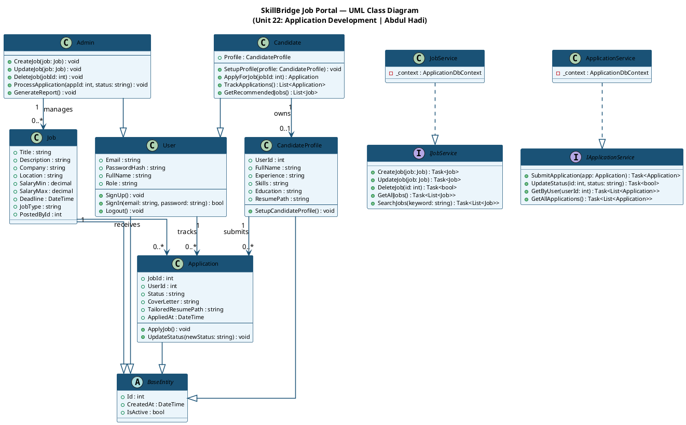
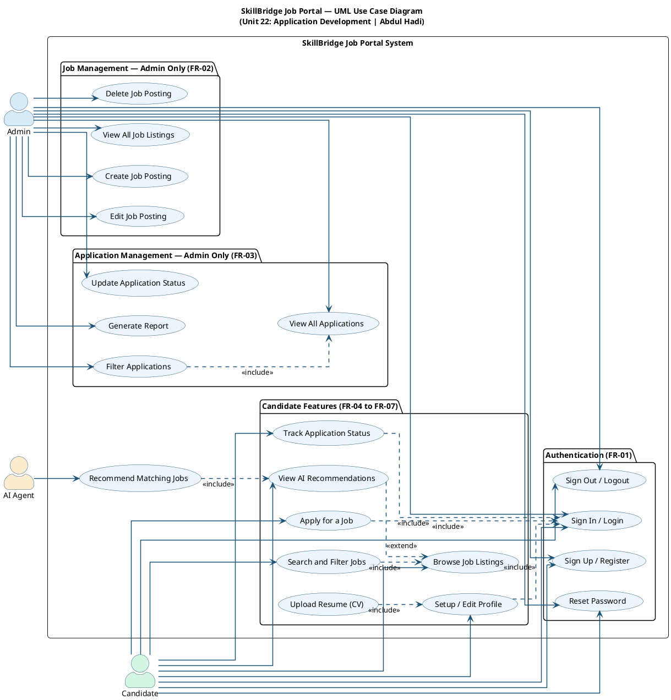
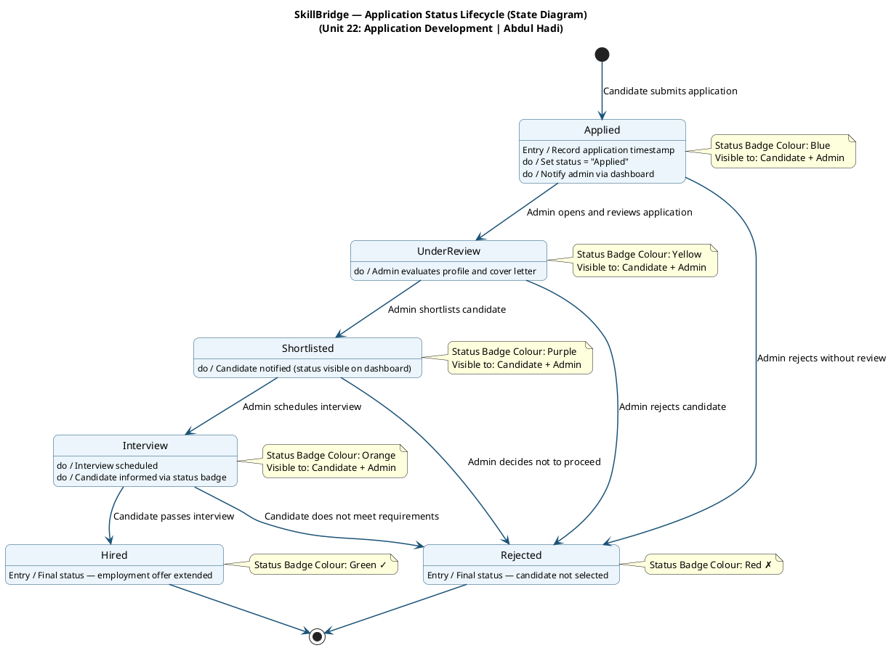
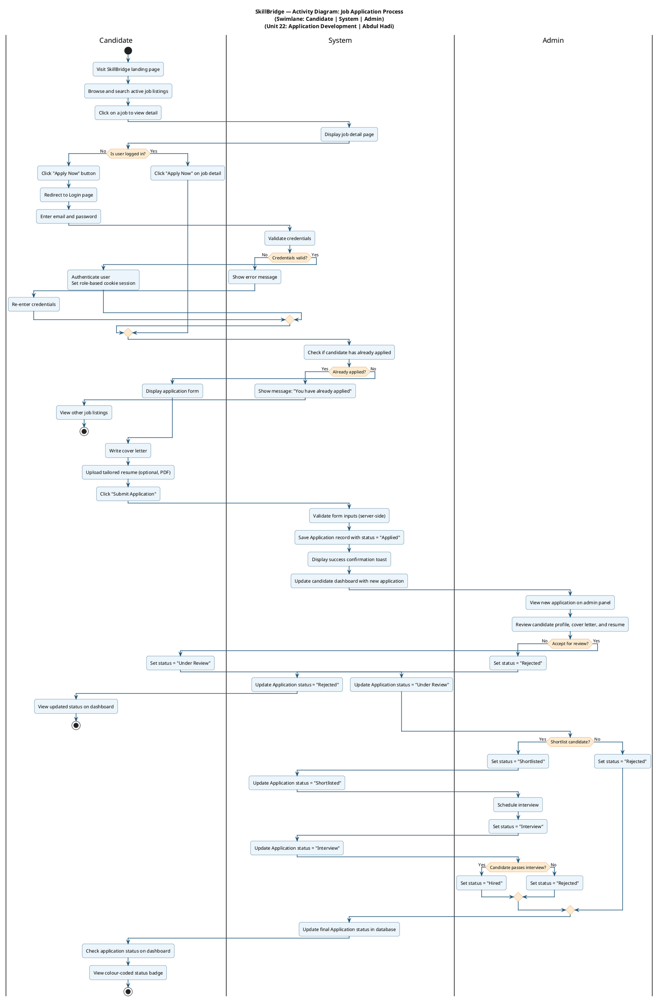

# AGENTIC TASK — Unit 22: Application Development
## SkillBridge Job Portal for Elevate Workforce Solutions
### Student: Abdul Hadi | ISMT College | University of Sunderland, UK

---

## STUDENT DETAILS
- Full Name: Abdul Hadi
- College: ISMT (International School of Management and Technology), Nepal
- Affiliated University: University of Sunderland, UK
- Unit: Unit 22 — Application Development (Unit Code: Y/618/7436), Level 5
- Assignment Title: Elevate Workforce Solutions
- Assessor: Bhuwan Subedi
- Submission Deadline: 15 July 2026
- Required Grade: DISTINCTION (must fulfil ALL of P1–P6, M1–M5, D1–D3)
- Word Count Target: 8000 words (acceptable range: 7200–8800 words)
- Document Format: Microsoft Word (.docx), Times New Roman, 12pt, 1.5 line spacing

---

## APPLICATION CONTEXT
You are building and fully documenting a job portal web application named **SkillBridge**, developed for the fictional client **Elevate Workforce Solutions**, a Nepal-based employment agency. The application follows strict **MVC (Model-View-Controller)** architecture and **Object-Oriented Programming** principles.

**Technology Stack:**
- Backend: ASP.NET Core 8 (C#) — REST API
- Frontend: Razor Views (ASP.NET Core MVC) or a separate frontend folder
- Database: MySQL running in Docker container
- ORM: Entity Framework Core (Code-First approach)
- Authentication: Cookie-based or JWT-based with role management
- Version Control: Git / GitHub
- IDE: VS Code with C# DevKit extension
- Containerisation: Docker Desktop

**GitHub Repository:** https://github.com/abdulhadinp/SkillBridge.Api_Abdul.git

---

## IMPORTANT — READ THIS BEFORE DOING ANYTHING

1. The assignment brief DOCX is in this directory. Read it in full first.
2. Explore the entire directory tree before modifying anything.
3. The practical code folder is already on this machine. Analyse it completely.
4. Do NOT start writing the Word document until all screenshots and diagrams exist.
5. Execute all phases in order. Do not skip phases.
6. Use British English spelling throughout all written content (colour, organise, centre, behaviour, recognise, analyse).
7. All Harvard references must be real, verifiable sources with working URLs. Do not fabricate any reference.

---

## PHASE 0 — DISCOVERY (MANDATORY FIRST STEP)

### 0.1 Read the Assignment
Read and fully understand the file `Unit_22_-_L5_Application_Development_-_May_13__2026__-_Bhuwan_Subedi.docx` in the current directory. Note every Pass, Merit, and Distinction criterion.

### 0.2 Explore the Project Directory
```bash
# List everything in the current directory (4 levels deep)
find . -maxdepth 4 -not -path '*/node_modules/*' -not -path '*/.git/*' -not -path '*/bin/*' -not -path '*/obj/*' | sort
```

### 0.3 Check Git State
```bash
git log --oneline --all --graph 2>/dev/null || echo "No git history"
git branch -a 2>/dev/null
git remote -v 2>/dev/null
```

### 0.4 Understand the Codebase
Read every `.cs`, `.csproj`, `Program.cs`, `appsettings.json`, `docker-compose.yml`, and any `.cshtml` or `.html` files. Understand exactly:
- Which models exist
- Which controllers exist
- Which views exist
- What the current database schema looks like
- What features are working, incomplete, or missing
- What the frontend stack is (Razor Views, static HTML, or separate React/Vue)

### 0.5 Identify Gaps Against Requirements
Cross-reference what you found in 0.4 against the complete feature list in Phase 1 below. Note every missing feature before you begin coding.

---

## PHASE 1 — CODE ENHANCEMENT AND COMPLETION

Do NOT replace working code. Analyse first, then add missing features, improve incomplete ones, and optimise UI. The goal is a fully production-quality application.

### 1.1 Required Features Checklist

#### Authentication System (FR-01)
- User registration (signup): full name, email, password, phone, address, qualification, preferred job type
- User login: email + password
- Password reset functionality
- Role-based access: two roles — `Admin` and `Candidate`
- Secure password hashing (BCrypt or ASP.NET Core Identity)
- Logout with session/cookie clearing
- Redirect unauthorised users appropriately

#### Job Management — Admin Only (FR-02)
- Create job: title, description, company name, location, salary min, salary max, deadline, job type (IT/Accounting/Teaching/Management/Other), is_active flag
- Read/list all jobs with: keyword search, filter by job type, filter by location, pagination (10 per page)
- Update any job posting
- Delete (soft delete — set is_active to false)
- Admin dashboard stats card: total jobs, active jobs, total applications, pending applications

#### Application Management — Admin Only (FR-03)
- View all applications with job title, candidate name, applied date, and current status
- Update application status through these exact states: Applied, Under Review, Shortlisted, Interview, Hired, Rejected
- Filter applications by: job, status, date range
- View individual candidate profile from the application list

#### Candidate Profile (FR-04)
- Setup/edit profile: full name, experience summary, skills (comma-separated tags), education details
- Upload CV/resume (PDF, stored in `/uploads/resumes/`)
- Profile completion percentage indicator

#### Public Job Listing — No Login Required (FR-05)
- Landing page displaying all active jobs with: title, company, location, salary range, job type badge, deadline
- Keyword search bar
- Filter by job type dropdown
- Pagination (10 jobs per page)
- Clicking a job opens the job detail page

#### Job Application — Candidates Only (FR-06)
- Apply button on job detail page (redirects to login if not authenticated)
- Application form: cover letter (textarea), upload tailored resume (optional, PDF)
- Prevent duplicate applications (show message if already applied)
- Confirmation message after successful application

#### Application Tracking — Candidates Only (FR-07)
- Candidate dashboard showing all own applications in a timeline/table
- Each row: job title, company, applied date, current status with colour-coded badge
- Status progression visible (Applied → Under Review → Shortlisted → Interview → Hired/Rejected)

#### AI Job Recommendation — Placeholder Feature
- On the candidate dashboard, show a "Recommended Jobs" section
- Simple recommendation logic: match jobs where job description contains keywords from the candidate's skills
- Label this section as "AI-Powered Recommendations" for the assignment documentation

### 1.2 Database Schema — Use Exactly This

If EF Core migrations exist, update them. If starting fresh, create these tables:

```csharp
// User
public class User
{
    public int Id { get; set; }
    [Required, MaxLength(250)]
    public string FullName { get; set; }
    [Required]
    public string Email { get; set; }
    [Required]
    public string PasswordHash { get; set; }
    [MaxLength(50)]
    public string Role { get; set; } = "Candidate"; // "Admin" or "Candidate"
    public bool IsActive { get; set; } = true;
    public DateTime CreatedAt { get; set; } = DateTime.UtcNow;
    public CandidateProfile? CandidateProfile { get; set; }
    public ICollection<Job> PostedJobs { get; set; }
}

// Job
public class Job
{
    public int Id { get; set; }
    [Required, MaxLength(600)]
    public string Title { get; set; }
    public string? Description { get; set; }
    public string? Company { get; set; }
    public string? Location { get; set; }
    public decimal? SalaryMin { get; set; }
    public decimal? SalaryMax { get; set; }
    public DateTime? Deadline { get; set; }
    public bool IsActive { get; set; } = true;
    public string? JobType { get; set; }
    public int PostedById { get; set; }
    public DateTime CreatedAt { get; set; } = DateTime.UtcNow;
    public User PostedBy { get; set; }
    public ICollection<Application> Applications { get; set; }
}

// CandidateProfile
public class CandidateProfile
{
    public int Id { get; set; }
    public int UserId { get; set; }
    [MaxLength(500)]
    public string? FullName { get; set; }
    [MaxLength(500)]
    public string? Experience { get; set; }
    public string? Skills { get; set; }
    public string? Education { get; set; }
    [MaxLength(500)]
    public string? ResumePath { get; set; }
    public User User { get; set; }
}

// Application
public class Application
{
    public int Id { get; set; }
    public int JobId { get; set; }
    public int UserId { get; set; }
    [MaxLength(100)]
    public string Status { get; set; } = "Applied";
    public DateTime AppliedAt { get; set; } = DateTime.UtcNow;
    public bool IsActive { get; set; } = true;
    public string? CoverLetter { get; set; }
    [MaxLength(500)]
    public string? TailoredResumePath { get; set; }
    public Job Job { get; set; }
    public User User { get; set; }
}
```

### 1.3 OOP Principles — Must Be Demonstrable

The code MUST clearly demonstrate these OOP principles so they can be documented:

**Encapsulation:** All model properties should use `{ get; set; }` with appropriate access modifiers. Business logic methods should be on service classes, not exposed directly.

**Abstraction:** Create at minimum an `IJobService` interface and `IApplicationService` interface with their concrete implementations. This hides implementation details behind a contract.

**Inheritance:** Create a `BaseEntity` class with `Id`, `CreatedAt`, `IsActive` that all entities inherit from. Create separate `AdminUser` and `CandidateUser` conceptual separation (handled via the Role field and role-specific controllers/views, or as partial classes if applicable).

**Polymorphism:** Use interface-based polymorphism through the service interfaces. At least one method should demonstrate overriding or interface implementation.

### 1.4 MVC Pattern — Must Be Enforced

- `Models/` folder: only data classes and ViewModels
- `Controllers/` folder: only request handling logic — no business logic in controllers
- `Views/` folder (if Razor): structured by controller name
- `Services/` folder: all business logic goes here
- `Data/` or `Repositories/` folder: all database access through EF Core DbContext
- No direct SQL strings in controllers — everything through EF Core

### 1.5 UI Enhancement Rules

- Use Bootstrap 5 (CDN is acceptable)
- Use Font Awesome 6 icons
- Consistent colour scheme: primary `#0d6efd` (Bootstrap blue), secondary `#6c757d`, success `#198754`
- Responsive navigation bar with role-based menu items (admin sees "Manage Jobs", "Applications"; candidate sees "Find Jobs", "My Applications", "Profile")
- Cards layout for job listings with hover shadow effect
- Status badges using Bootstrap badge classes with colours: Applied = blue, Under Review = yellow, Shortlisted = purple, Interview = orange, Hired = green, Rejected = red
- Toast notifications for successful actions
- Meaningful page titles in the `<title>` tag and `<h1>` headings
- 404 and error pages styled to match the rest of the site

### 1.6 Seeder — Create Test Data

Create a `DataSeeder.cs` that runs on startup in Development mode only, populating:
- 1 Admin: email `admin@skillbridge.np`, password `Admin@123`, full name `Admin User`
- 5 Candidates with realistic Nepali names, emails, and filled profiles with skills
- 12 diverse job listings across categories: IT, Accounting, Teaching, Management
- 8 applications in different statuses across candidates and jobs

---

## PHASE 2 — GITHUB SETUP AND BRANCH STRATEGY

### 2.1 Reset and Reinitialise Git

```bash
# Remove existing git history
rm -rf .git

# Initialise fresh
git init
git config user.name "Abdul Hadi"
git config user.email "abdulhadi4172@gmail.com"
```

> NOTE TO STUDENT: Replace `abdulhadi4172@gmail.com` with your actual GitHub-registered email before running this prompt.

### 2.2 Create .gitignore

Create `.gitignore` with all standard .NET entries including:
- `bin/`, `obj/`, `.vs/`, `*.user`
- `appsettings.Development.json`
- `uploads/` folder contents (keep the folder with `.gitkeep`)
- `*.db`, `*.sqlite`
- Node modules if any frontend is present

### 2.3 Connect Remote and Create Branch Structure

Create branches in this exact order, committing relevant code to each:

```bash
git remote add origin https://github.com/abdulhadinp/SkillBridge.Api_Abdul.git

# Feature branches — commit relevant code to each before merging
git checkout -b feature/authentication
git add .
git commit -m "feat: implement authentication system — signup, login, logout, role-based access"

git checkout -b feature/job-management
git commit -m "feat: implement CRUD job management for Admin with search, filter, pagination"

git checkout -b feature/candidate-features
git commit -m "feat: implement candidate profile setup, job application, and application tracking"

git checkout -b feature/admin-panel
git commit -m "feat: implement admin dashboard, application management, and status updates"

git checkout -b feature/ui-enhancement
git commit -m "feat: enhance UI with Bootstrap 5, responsive design, and UX improvements"

# develop branch — merge all features
git checkout -b develop
git merge feature/authentication --no-ff -m "Merge feature/authentication into develop"
git merge feature/job-management --no-ff -m "Merge feature/job-management into develop"
git merge feature/candidate-features --no-ff -m "Merge feature/candidate-features into develop"
git merge feature/admin-panel --no-ff -m "Merge feature/admin-panel into develop"
git merge feature/ui-enhancement --no-ff -m "Merge feature/ui-enhancement into develop"

# main branch — production release
git checkout -b main
git merge develop --no-ff -m "Release v1.0.0 — Production-ready SkillBridge Job Portal"
git tag -a v1.0.0 -m "Version 1.0.0 — Unit 22 Assignment Submission"
```

### 2.4 Push Everything to GitHub

```bash
git push -u origin main
git push origin develop
git push origin feature/authentication
git push origin feature/job-management
git push origin feature/candidate-features
git push origin feature/admin-panel
git push origin feature/ui-enhancement
git push origin --tags
```

---

## PHASE 3 — RUN THE APPLICATION AND TAKE SCREENSHOTS

### 3.1 Start Docker and Database

```bash
# Start MySQL container
docker-compose up -d

# Wait for MySQL to initialise
sleep 15

# Apply EF Core migrations
dotnet ef database update

# Verify tables were created
docker exec -it [mysql_container_name] mysql -u root -p -e "USE skillbridge; SHOW TABLES;"
```

### 3.2 Start the Application

```bash
dotnet run
```

Wait until you see output confirming the app is running (typically `Now listening on: http://localhost:5000` or similar). Note the exact port.

### 3.3 Take Screenshots

Create a `screenshots/` folder. Use Python + Playwright to take screenshots. If Playwright is not available, use `html2image` or `selenium`. As a last resort, generate descriptive placeholder images with labels so the document still embeds something.

Install Playwright:
```bash
pip install playwright --break-system-packages
playwright install chromium --with-deps
```

Take screenshots of ALL the following pages, saving to `screenshots/`:

```python
from playwright.sync_api import sync_playwright
import time

BASE_URL = "http://localhost:5000"  # Update port if different

with sync_playwright() as p:
    browser = p.chromium.launch(headless=True)
    page = browser.new_page(viewport={"width": 1400, "height": 900})

    # 01 - Landing page (public)
    page.goto(f"{BASE_URL}/")
    page.wait_for_load_state("networkidle")
    page.screenshot(path="screenshots/01_landing_page.png", full_page=True)

    # 02 - Login page
    page.goto(f"{BASE_URL}/auth/login")
    page.wait_for_load_state("networkidle")
    page.screenshot(path="screenshots/02_login_page.png")

    # 03 - Signup/Register page
    page.goto(f"{BASE_URL}/auth/register")
    page.wait_for_load_state("networkidle")
    page.screenshot(path="screenshots/03_signup_page.png")

    # Login as admin
    page.goto(f"{BASE_URL}/auth/login")
    page.fill("input[name='email'], input[type='email']", "admin@skillbridge.np")
    page.fill("input[name='password'], input[type='password']", "Admin@123")
    page.click("button[type='submit']")
    page.wait_for_load_state("networkidle")

    # 10 - Admin dashboard
    page.screenshot(path="screenshots/10_admin_dashboard.png", full_page=True)

    # 11 - Admin job list
    page.goto(f"{BASE_URL}/admin/jobs")
    page.wait_for_load_state("networkidle")
    page.screenshot(path="screenshots/11_admin_job_list.png", full_page=True)

    # 12 - Add job form
    page.goto(f"{BASE_URL}/admin/jobs/create")
    page.wait_for_load_state("networkidle")
    page.screenshot(path="screenshots/12_admin_add_job.png", full_page=True)

    # 13 - Applications list (admin)
    page.goto(f"{BASE_URL}/admin/applications")
    page.wait_for_load_state("networkidle")
    page.screenshot(path="screenshots/13_admin_applications.png", full_page=True)

    # 14 - Update application status
    page.goto(f"{BASE_URL}/admin/applications/1")
    page.wait_for_load_state("networkidle")
    page.screenshot(path="screenshots/14_admin_update_status.png", full_page=True)

    # Logout admin
    page.goto(f"{BASE_URL}/auth/logout")
    page.wait_for_load_state("networkidle")

    # Login as candidate
    page.goto(f"{BASE_URL}/auth/login")
    page.fill("input[name='email'], input[type='email']", "candidate1@example.com")
    page.fill("input[name='password'], input[type='password']", "Test@123")
    page.click("button[type='submit']")
    page.wait_for_load_state("networkidle")

    # 04 - Candidate dashboard
    page.screenshot(path="screenshots/04_candidate_dashboard.png", full_page=True)

    # 05 - Candidate profile
    page.goto(f"{BASE_URL}/candidate/profile")
    page.wait_for_load_state("networkidle")
    page.screenshot(path="screenshots/05_candidate_profile.png", full_page=True)

    # 06 - Job detail page
    page.goto(f"{BASE_URL}/jobs/1")
    page.wait_for_load_state("networkidle")
    page.screenshot(path="screenshots/06_job_detail.png", full_page=True)

    # 07 - Apply job form
    page.goto(f"{BASE_URL}/jobs/1/apply")
    page.wait_for_load_state("networkidle")
    page.screenshot(path="screenshots/07_apply_job.png", full_page=True)

    # 08 - Track applications
    page.goto(f"{BASE_URL}/candidate/applications")
    page.wait_for_load_state("networkidle")
    page.screenshot(path="screenshots/08_track_applications.png", full_page=True)

    # 15 - Search/filter jobs (public)
    page.goto(f"{BASE_URL}/auth/logout")
    page.goto(f"{BASE_URL}/?keyword=developer&type=IT")
    page.wait_for_load_state("networkidle")
    page.screenshot(path="screenshots/15_search_jobs.png", full_page=True)

    browser.close()
    print("All screenshots saved to screenshots/ folder")
```

> If Playwright fails due to environment restrictions, generate descriptive placeholder PNG images using Python matplotlib with the screen name as a label, so diagrams can still be embedded in the Word document.

---

## PHASE 4 — GENERATE ALL REQUIRED DIAGRAMS

Create a `diagrams/` folder. Generate all diagrams as high-quality PNG files (minimum 1600x900 pixels) using Python. Use `matplotlib`, `graphviz`, or SVG generation. Label every element clearly.

Install dependencies:
```bash
pip install matplotlib graphviz pillow --break-system-packages
```

Generate diagrams in this exact order, saving to `diagrams/`:

---

### DIAGRAM 1 — System Architecture / System Design (REST API Flow)
Filename: `diagrams/01_system_design.png`

Show these components connected with arrows:
- Client (Browser/User) on the left
- Arrow right: HTTP Request (HTTPS)
- ASP.NET Core MVC Application (centre)
- Arrow down: Entity Framework Core (ORM Layer)
- Arrow down: MySQL Database in Docker Container
- Side branch from ASP.NET: AI Recommendation Service (keyword matching)
- Arrow left back: HTTP Response (HTML/JSON)

Use professional box shapes, a white or light-grey background, and clear labels.

---

### DIAGRAM 2 — Use Case Diagram (UML)
Filename: `diagrams/02_use_case.png`

Draw a proper UML use case diagram:

**Actors (stick figures on left/right):**
- Admin (left)
- Candidate (left)
- AI Agent (right — for the recommendation use case)

**System Boundary (rectangle, labelled "SkillBridge — Job Portal"):**

Admin use cases (ovals):
- Sign Up / Sign In / Reset Password
- Create Job Posting
- Update Job Posting
- Delete Job Posting
- View All Applications
- Update Application Status
- Generate Application Report

Candidate use cases (ovals):
- Sign Up / Sign In / Reset Password
- Setup / Edit Profile
- View and Search Job Listings
- Apply for a Job
- Track Application Status
- View AI Job Recommendations

AI Agent use case:
- Recommend Jobs (connected from Candidate)

Show `<<include>>` and `<<extend>>` relationships:
- "Apply for a Job" <<includes>> "Sign In"
- "View AI Job Recommendations" <<extends>> "View and Search Job Listings"

---

### DIAGRAM 3 — Flowchart
Filename: `diagrams/03_flowchart.png`

Draw a complete application flowchart:

```
[Start]
    |
[Sign Up / Sign In]
    |
[Decision Diamond: User Type?]
    |                 |
[Candidate]       [Admin]
    |                 |
[Setup Profile]   [CRUD Job Postings]
    |                 |
[View/Search      [View / Filter
  Filter Jobs]     Applications]
    |                 |
[AI Job          [Process Application
Recommendations]  / Update Status]
    |                 |
[Apply for Job]  [Generate Report]
    |                 |
[Track           [End]
Application]
    |
  [End]
```

Use standard flowchart shapes: oval (start/end), rectangle (process), diamond (decision).

---

### DIAGRAM 4 — UML Activity Diagram (Job Application Process)
Filename: `diagrams/04_activity_diagram.png`

Swimlane activity diagram with three lanes:
- Lane 1: Candidate
- Lane 2: System (SkillBridge)
- Lane 3: Admin

Activity flow:
1. Candidate: Browse job listings
2. System: Display active jobs with search/filter
3. Candidate: Select a job / click Apply
4. System: Check if candidate is authenticated
5. System: If not, redirect to login; if yes, display application form
6. Candidate: Fill cover letter, upload resume, submit
7. System: Validate and store application (status = "Applied")
8. System: Notify Admin (email stub / dashboard update)
9. Admin: Review application
10. Admin: Update status (Under Review / Shortlisted / Rejected / Interview / Hired)
11. System: Update status in database
12. Candidate: Check application status on dashboard

---

### DIAGRAM 5 — UML State Diagram (Application Status Lifecycle)
Filename: `diagrams/05_state_diagram.png`

Draw the application status state machine:

- Initial state (filled circle): ● → **Applied**
- Applied → Under Review (Admin opens application)
- Under Review → Shortlisted (Admin shortlists)
- Under Review → Rejected (Admin rejects)
- Shortlisted → Interview (Admin schedules interview)
- Interview → Hired (Candidate passes)
- Interview → Rejected (Candidate does not proceed)
- Hired → Final state (double circle)
- Rejected → Final state (double circle)

Label each transition arrow with the triggering event.

---

### DIAGRAM 6 — Entity-Relationship (E-R) Diagram
Filename: `diagrams/06_er_diagram.png`

Draw a proper Chen-notation or Crow's Foot ER diagram:

Entities with attributes:
- **User**: _Id_ (PK), FullName, Email, PasswordHash, Role, IsActive, CreatedAt
- **Job**: _Id_ (PK), Title, Description, Company, Location, SalaryMin, SalaryMax, Deadline, IsActive, JobType, CreatedAt, _PostedById_ (FK)
- **CandidateProfile**: _Id_ (PK), _UserId_ (FK), FullName, Experience, Skills, Education, ResumePath
- **Application**: _Id_ (PK), _JobId_ (FK), _UserId_ (FK), Status, AppliedAt, IsActive, CoverLetter, TailoredResumePath

Relationships:
- User (1) — has — (0..1) CandidateProfile
- User (1) — posts — (many) Jobs
- CandidateProfile (1) — submits — (many) Applications
- Job (1) — receives — (many) Applications

---

### DIAGRAM 7 — DFD Level 0 (Context Diagram)
Filename: `diagrams/07_dfd_level0.png`

Draw a simple context DFD:

External entities (squares):
- Admin
- Candidate

Central process (circle or rectangle, level 0): **SkillBridge Job Portal System**

Data flows (labelled arrows):
- Admin → System: Job data, status decisions, login credentials
- Candidate → System: Registration data, profile data, application data, login credentials
- System → Admin: Application lists, reports, job management confirmations
- System → Candidate: Job listings, application status, recommendations
- System ↔ Data Store: Database (MySQL)

---

### DIAGRAM 8 — DFD Level 1 (First-Level Decomposition)
Filename: `diagrams/08_dfd_level1.png`

Decompose the central process into sub-processes:

Sub-processes:
- **1.0 Authentication Process** (handles signup, login, logout)
- **2.0 Job Management Process** (CRUD by admin)
- **3.0 Application Management Process** (apply, track, update status)
- **4.0 Profile Management Process** (setup, edit candidate profile)
- **5.0 Reporting Process** (admin reports and stats)

Data Stores (rectangles with open side):
- D1: Users Table
- D2: Jobs Table
- D3: Applications Table
- D4: CandidateProfiles Table

Show data flows between external entities, processes, and data stores.

---

### DIAGRAM 9 — UML Class Diagram
Filename: `diagrams/09_class_diagram.png`

Draw a proper UML class diagram with the following classes, attributes, and methods:

```
BaseEntity (abstract)
+ Id: int
+ CreatedAt: DateTime
+ IsActive: bool

User (inherits BaseEntity)
+ Email: string
+ PasswordHash: string
+ FullName: string
+ Role: string
+ SignUp(): void
+ SignIn(email, password): bool
+ Logout(): void

Candidate (inherits User)
+ Profile: CandidateProfile
+ SetupProfile(profile: CandidateProfile): void
+ ApplyForJob(jobId: int): Application
+ TrackApplications(): List<Application>
+ GetRecommendedJobs(): List<Job>

Admin (inherits User)
+ CreateJob(job: Job): void
+ UpdateJob(job: Job): void
+ DeleteJob(jobId: int): void
+ ProcessApplication(appId: int, status: string): void
+ GenerateReport(): Report

Job (inherits BaseEntity)
+ Title: string
+ Description: string
+ Company: string
+ Location: string
+ SalaryMin: decimal
+ SalaryMax: decimal
+ Deadline: DateTime
+ JobType: string
+ PostedById: int

CandidateProfile (inherits BaseEntity)
+ UserId: int
+ FullName: string
+ Experience: string
+ Skills: string
+ Education: string
+ ResumePath: string
+ SetupCandidateProfile(): void

Application (inherits BaseEntity)
+ JobId: int
+ UserId: int
+ Status: string
+ CoverLetter: string
+ TailoredResumePath: string
+ ApplyJob(): void
+ UpdateStatus(newStatus: string): void

IJobService (interface)
+ CreateJob(job: Job): Task<Job>
+ UpdateJob(job: Job): Task<Job>
+ DeleteJob(id: int): Task<bool>
+ GetAllJobs(): Task<List<Job>>

IApplicationService (interface)
+ SubmitApplication(app: Application): Task<Application>
+ UpdateStatus(id: int, status: string): Task<bool>
+ GetByUser(userId: int): Task<List<Application>>
```

Show:
- Inheritance arrows (hollow triangle): Candidate, Admin → User; User → BaseEntity; Job, CandidateProfile, Application → BaseEntity
- Association arrows: Application → Job, Application → User, CandidateProfile → User
- Dashed implementation arrows: JobService implements IJobService, ApplicationService implements IApplicationService

---

### DIAGRAM 10 — MVC Architecture Diagram
Filename: `diagrams/10_mvc_architecture.png`

Draw the MVC pattern specific to SkillBridge:

Three vertical sections or layers:
- **Model Layer** (left): User.cs, Job.cs, Application.cs, CandidateProfile.cs, ApplicationDbContext.cs, IJobService, IApplicationService
- **Controller Layer** (centre): AuthController, JobController, ApplicationController, AdminController, HomeController
- **View Layer** (right): Login.cshtml, Register.cshtml, JobList.cshtml, JobDetail.cshtml, AdminDashboard.cshtml, CandidateDashboard.cshtml

Flow arrows:
- Browser → HTTP Request → Controller
- Controller → calls → Model/Service
- Model/Service → queries → MySQL Database (Docker)
- Database → data → Model/Service
- Model/Service → data → Controller
- Controller → passes ViewModel → View
- View → HTTP Response (HTML) → Browser

---

### DIAGRAM 11 — Trello Board Mockup
Filename: `diagrams/11_trello_board.png`

Generate a Kanban-style Trello board image using Python matplotlib/PIL:

Board title: **SkillBridge — Unit 22 Development Board**

Create 7 columns side by side on a dark blue background (#026aa7):

**Column 1 — Backlog** (light grey)
Cards (white rectangles with text):
- Research ASP.NET Core MVC
- Design database schema
- Create wireframes in Stitch
- Set up Docker MySQL

**Column 2 — Sprint 1 | Apr 20 – May 3** (light blue header)
Cards:
- Project initialisation (.NET setup)
- Docker Compose for MySQL
- Database models and EF Core
- Initial migration

**Column 3 — Sprint 2 | May 4 – May 17** (light blue header)
Cards:
- User registration endpoint
- Login/logout with cookies
- Password hashing (BCrypt)
- Role-based access control

**Column 4 — Sprint 3 | May 18 – May 31** (light blue header)
Cards:
- Job CRUD (Admin)
- Public job listing page
- Search and filter functionality
- Pagination implementation

**Column 5 — Sprint 4 | Jun 1 – Jun 14** (light blue header)
Cards:
- Candidate profile setup
- CV/resume upload feature
- Job application form
- Application tracking view

**Column 6 — Sprint 5 | Jun 15 – Jun 28** (light blue header)
Cards:
- Admin dashboard with stats
- Application status management
- AI recommendation prototype
- UI polish and responsiveness

**Column 7 — Done** (green header)
Cards:
- Requirements analysis
- Software design document
- GitHub repository setup
- Database schema finalised

Each card should have a coloured label strip at the top (e.g., red=high priority, yellow=medium, green=done).

---

## PHASE 5 — WRITE THE WORD DOCUMENT

Create the complete assignment Word document using Python `python-docx` library.

```bash
pip install python-docx --break-system-packages
```

Filename: `Abdul_Hadi_Unit22_Application_Development.docx`

### Document Formatting Rules (Apply to Every Section):
- Font: Times New Roman
- Body text: 12pt
- Heading 1: 16pt Bold
- Heading 2: 14pt Bold
- Heading 3: 12pt Bold, Italic
- Line spacing: 1.5 lines (multiply = 1.5)
- Paragraph spacing after: 8pt
- Margins: 1 inch (2.54 cm) all sides
- Header: "Unit 22: Application Development | Abdul Hadi | ISMT College" (12pt, Times New Roman)
- Footer: Page number centred (format: "Page X")
- All tables: clean border style with alternating row shading
- All images: centred, with a caption below in 10pt italic

---

### COVER PAGE

Centre-aligned content:
- Logo placeholder or "ISMT" text in large font
- "International School of Management and Technology, Nepal"
- "Faculty of Computing"
- "University of Sunderland, UK — Level 5"
- Horizontal divider line
- **Unit 22: Application Development**
- **Assignment Title: Elevate Workforce Solutions — SkillBridge Job Portal**
- Student Name: Abdul Hadi
- Student ID: [Leave blank — student to fill]
- Assessor: Bhuwan Subedi
- Issue Date: 13 May 2026
- Submission Date: 15 July 2026
- Word Count: [calculate and insert actual count]
- Page break after cover page

---

### TABLE OF CONTENTS
Insert a simple manual table of contents listing all main sections (Activity 1, 1.1, 1.2 ... Activity 2 ... Activity 3 ... References).

---

### ACTIVITY 1 — SOFTWARE DESIGN DOCUMENT (~3800 words)
(Covers: P1, P2, P3, M1, M2, D1)

#### 1.1 Introduction

Write 2–3 paragraphs introducing:
- The assignment context: you have been hired as a web developer at Code Art Web Technologies, tasked with building a job portal for Elevate Workforce Solutions
- Brief description of SkillBridge and its purpose
- What Activity 1 covers (problem definition, risk analysis, tools research, system design)

Write in first person, past tense where describing completed work, present tense for the running system. Natural, academic British English.

---

#### 1.2 Problem Definition Statement (P1)

Write a detailed Problem Definition Statement (400–500 words) covering:

**Current Situation:**
Elevate Workforce Solutions is a well-established employment agency in Nepal. Their current operations depend heavily on manual processes — job seekers visit the office physically or call by phone to enquire about vacancies. Employers submit job listings by paper or email. This approach creates significant inefficiencies: candidates cannot easily discover suitable opportunities, and employers cannot reach a broad pool of applicants.

**Business Problem:**
The lack of a digital platform limits Elevate Workforce Solutions to serving only candidates within their immediate geographic area. There is no transparent system for candidates to track the status of their applications, which results in repeated enquiries and wasted administrative time. Additionally, the agency faces growing competition from established online job portals across Nepal.

**Proposed Solution:**
The proposed solution is a web-based job portal named SkillBridge, designed and built using ASP.NET Core 8 (C#) with a MySQL database hosted in a Docker container. The application follows the Model-View-Controller (MVC) architectural pattern and Object-Oriented Programming (OOP) principles. SkillBridge will enable Elevate Workforce Solutions to digitise their operations, provide transparency to candidates, and extend their service reach across Nepal.

**Business Goals aligned to the solution:**
- Digital transformation of manual job listing and application processes
- Equal and transparent access to employment opportunities regardless of geographic location
- Reduction of administrative burden through automated status tracking
- Professional online presence that can grow with the company's future needs

---

#### 1.3 User Requirements (P1)

Write a short introduction, then present requirements in a table:

| ID | User Requirement | Priority |
|----|-----------------|----------|
| UR-01 | Users must be able to register for an account by providing their full name, email, password, phone number, address, qualification, and preferred job type. | High |
| UR-02 | Registered users must be able to log in securely and log out of the system. | High |
| UR-03 | Job seekers must be able to browse, search, and filter all active job listings on the public landing page without requiring a login. | High |
| UR-04 | Authenticated candidates must be able to apply for a job by submitting a cover letter and uploading an optional tailored resume. | High |
| UR-05 | Candidates must be able to track the real-time status of all their submitted applications from a personal dashboard. | High |
| UR-06 | Admin users must be able to create, update, and delete job postings through a dedicated management interface. | High |
| UR-07 | Admin users must be able to view all submitted applications and update each application's status through a defined workflow. | High |
| UR-08 | The system must be accessible and fully functional on mobile, tablet, and desktop screen sizes. | Medium |
| UR-09 | Candidates must be able to set up and update a personal profile including their skills, educational background, experience, and resume. | Medium |
| UR-10 | The system should suggest relevant job listings to candidates based on the skills listed in their profile. | Low |

---

#### 1.4 System Requirements (P1)

**1.4.1 Functional Requirements**

Write a brief introduction, then present the functional requirements table:

| ID | Functional Requirement | Description |
|----|----------------------|-------------|
| FR-01 | Authentication and Authorisation | The system shall allow users to sign up, sign in, reset passwords, and sign out. Role-based access control shall distinguish between Admin and Candidate roles. |
| FR-02 | Job Management (Admin) | The system shall allow Admins to create, read, update, and delete job postings. Each job shall include: title, description, company, location, salary range, deadline, job type, and active status. |
| FR-03 | Application Management (Admin) | The system shall allow Admins to view all submitted applications, filter by job or status, and update the application status through a defined workflow. |
| FR-04 | Candidate Profile Management | The system shall allow candidates to create and update a profile containing their full name, experience, skills, education details, and resume upload. |
| FR-05 | Public Job Listing | The system shall display all active job listings on a public landing page with keyword search, category filter, and pagination (10 results per page). |
| FR-06 | Job Application (Candidates) | The system shall allow authenticated candidates to apply for a job once, submitting a cover letter and optional tailored resume. Duplicate applications shall be prevented. |
| FR-07 | Application Tracking | The system shall display all applications submitted by a candidate on their dashboard, showing the current status with visual colour-coded badges. |

**1.4.2 Non-Functional Requirements**

| ID | Requirement | Description | Measurement |
|----|------------|-------------|-------------|
| NFR-01 | Responsive Design | The application shall adapt to mobile (375px+), tablet (768px+), and desktop (1024px+) screen widths. | Bootstrap 5 breakpoints used |
| NFR-02 | Accessibility | The application shall conform to WCAG 2.1 Level AA guidelines. | Semantic HTML, alt text on images, colour contrast ratio ≥ 4.5:1 |
| NFR-03 | Security | Passwords shall be hashed using BCrypt. All authenticated routes shall be protected. Input fields shall be validated server-side. | BCrypt hash rounds ≥ 10; server-side ModelState validation |
| NFR-04 | Data Privacy | User personal data shall only be accessible to authorised roles. Passwords shall never be stored in plain text. | Role-based authorisation attributes on all sensitive controllers |
| NFR-05 | Performance | Page load times shall not exceed three seconds under normal load. | Measured using browser developer tools |
| NFR-06 | Scalability | The database shall run in a Docker container enabling straightforward deployment to any cloud provider. | Docker Compose configuration; environment-variable-based connection strings |
| NFR-07 | Reliability and Availability | The system shall handle invalid inputs gracefully and display appropriate error messages rather than crashing. | Try-catch blocks; ModelState validation; custom error pages |

---

#### 1.5 Risk Analysis (P2)

Write a brief introduction explaining why risk analysis is important in software development. Then present the risk register:

| Risk ID | Risk Description | Likelihood | Impact | Risk Level | Mitigation Strategy |
|---------|----------------|-----------|--------|-----------|-------------------|
| R-01 | Data security breach — unauthorised access to user credentials or personal data | Medium | High | High | Passwords hashed with BCrypt; HTTPS enforced; JWT token expiry set; server-side input validation prevents injection attacks |
| R-02 | Database failure or data loss — MySQL container crash or data corruption | Low | High | High | Docker volume persistence configured; regular `.sql` dump backups during development; EF Core migrations tracked in version control |
| R-03 | Scope creep — feature requests expanding beyond the agreed timeline | Medium | Medium | Medium | Agile sprint planning with Trello; strict sprint backlog; features beyond MVP deferred to future releases |
| R-04 | Technology compatibility issues — .NET version conflicts or library deprecations | Low | Medium | Low | .NET 8 LTS version selected for long-term support; Docker isolates the environment; NuGet package versions pinned in `.csproj` |
| R-05 | Poor UI/UX leading to low user adoption | Medium | Medium | Medium | Bootstrap 5 used for consistent responsive design; peer review conducted to gather usability feedback; iterative improvements based on feedback |
| R-06 | Single-developer knowledge risk — all knowledge held by one person | Low | High | Medium | Comprehensive code comments; GitHub version control with commit history; this assignment document serves as technical documentation |
| R-07 | File upload vulnerabilities — malicious file uploads to the server | Medium | High | High | File type validation (PDF only); file size limit enforced server-side; uploaded files stored outside the web root |

---

#### 1.6 Software Development Tools and Techniques Research (P3, M2)

Write a proper introduction for this section (2–3 sentences). Then write about each tool/technology in a sub-section with analysis, not just description.

**1.6.1 Programming Language — C# and ASP.NET Core 8**

Write 200–250 words covering: C# as a statically typed, object-oriented language; ASP.NET Core as a cross-platform web framework; why it was chosen over alternatives; benefits such as strongly typed models, built-in dependency injection, and Razor templating. Include Harvard in-text citation for Microsoft documentation.

**1.6.2 Database Management — MySQL with Docker**

Write 200–250 words covering: MySQL as an open-source relational database management system; Docker containerisation ensuring environment consistency; how docker-compose.yml defines the MySQL service; why MySQL was selected. Include Harvard in-text citation for MySQL and Docker documentation.

**1.6.3 Object-Relational Mapper — Entity Framework Core**

Write 150–200 words covering: EF Core as Microsoft's official ORM for .NET; code-first migrations; how it eliminates repetitive SQL; trade-offs (e.g. performance vs raw SQL for complex queries). Harvard citation.

**1.6.4 Version Control — Git and GitHub**

Write 150–200 words covering: distributed version control; branching strategy used (feature branches, develop, main); semantic commit messages; GitHub for remote hosting and collaboration evidence. Harvard citation.

**1.6.5 Development Environment — VS Code with C# DevKit**

Write 150 words covering: VS Code as lightweight, cross-platform IDE; C# DevKit extension providing IntelliSense, debugging, and EF Core tooling integration.

**1.6.6 Project Management — Agile Methodology with Trello**

Write 200–250 words covering: Agile principles; sprint planning; user stories; Trello as the Kanban board tool; how sprints were defined for this project.

---

#### 1.7 Comparison of Tools and Methodology Justification (M2, D1)

**1.7.1 Programming Framework Comparison**

Present a comparison table:

| Criterion | ASP.NET Core (C#) | Django (Python) | Node.js (Express) | Spring Boot (Java) |
|----------|----------------|-----------------|--------------------|-------------------|
| Language | C# | Python | JavaScript | Java |
| Architecture | MVC, API | MVT | Non-opinionated | MVC |
| Performance | High | Medium | High | High |
| ORM Support | Entity Framework | Django ORM | Sequelize | Hibernate |
| Learning Curve | Medium | Low | Low | High |
| Deployment | Cross-platform | Cross-platform | Cross-platform | Cross-platform |
| Community | Large | Very Large | Very Large | Large |

Write 150–200 words justifying why ASP.NET Core was chosen, referencing the comparison.

**1.7.2 Database Comparison**

| Criterion | MySQL | PostgreSQL | SQL Server | SQLite |
|----------|-------|-----------|-----------|--------|
| Cost | Free/Open Source | Free/Open Source | Paid (Express free) | Free |
| Performance | Good | Excellent | Excellent | Limited |
| Docker Support | Excellent | Excellent | Good | N/A |
| EF Core Support | Full | Full | Full | Full |
| JSON Support | Good | Excellent | Good | Limited |

Write 100 words justifying MySQL.

**1.7.3 Development Methodology Comparison**

| Criterion | Waterfall | Agile/Scrum | RAD | Spiral |
|----------|-----------|-------------|-----|--------|
| Flexibility | Rigid | Highly Flexible | Flexible | Moderate |
| Client Involvement | Low | High | High | Medium |
| Suitable for small teams | No | Yes | Yes | No |
| Risk management | Low | Continuous | Low | High |
| Documentation | Heavy | Lightweight | Minimal | Moderate |

Write 200 words justifying Agile selection for this project, including specific reasons (small team, evolving requirements, iterative delivery).

**1.7.4 Evaluation of Solution and Methodology (D1)**

Write 300–350 words critically evaluating:
- Whether ASP.NET Core MVC was ultimately the right choice
- Whether Agile was the right methodology
- What would you do differently if the project were to be rebuilt
- Comparison of actual outcomes against theoretical benefits of chosen tools
This section must show critical evaluation, not just description. Use phrases like "In retrospect...", "One limitation that became apparent...", "Had the project used X instead..."

---

#### 1.8 System Analysis (M1)

Write 250–300 words using structured analysis. Cover:
- Feasibility study: technical feasibility (familiar technology stack), economic feasibility (free/open-source tools), operational feasibility (web-based, accessible anywhere)
- Stakeholder analysis (Admin/Employer, Candidate/Job Seeker, System Administrator)
- SDLC phase used (Agile sprints as iterative SDLC cycles)

---

#### 1.9 System Design (M1)

**1.9.1 System Architecture**
[Insert diagram: diagrams/01_system_design.png]
Caption: Figure 1 — SkillBridge System Architecture Diagram

Write 150 words explaining the three-tier architecture and REST API flow shown in the diagram.

**1.9.2 MVC Architecture**
[Insert diagram: diagrams/10_mvc_architecture.png]
Caption: Figure 2 — MVC Architecture Diagram for SkillBridge

Write 200 words explaining how MVC is implemented in SkillBridge: what each layer contains, how the request flows from browser through controller to model and back to view.

**1.9.3 Use Case Diagram**
[Insert diagram: diagrams/02_use_case.png]
Caption: Figure 3 — UML Use Case Diagram

Write 150 words explaining the actors (Admin, Candidate, AI Agent) and the key use cases. Reference <<include>> and <<extend>> relationships shown.

**1.9.4 Flowchart**
[Insert diagram: diagrams/03_flowchart.png]
Caption: Figure 4 — Application Flowchart

Write 100 words walking through the main flow for both user roles.

**1.9.5 Activity Diagram**
[Insert diagram: diagrams/04_activity_diagram.png]
Caption: Figure 5 — UML Activity Diagram (Job Application Process)

Write 120 words explaining the swimlane diagram.

**1.9.6 State Diagram**
[Insert diagram: diagrams/05_state_diagram.png]
Caption: Figure 6 — UML State Diagram (Application Status Lifecycle)

Write 120 words explaining each state and the transitions between them.

**1.9.7 Entity-Relationship (E-R) Diagram**
[Insert diagram: diagrams/06_er_diagram.png]
Caption: Figure 7 — Entity-Relationship Diagram

Write 150 words explaining the four entities, their attributes, and the relationships between them, including cardinality.

**1.9.8 Data Flow Diagram — Level 0 (Context Diagram)**
[Insert diagram: diagrams/07_dfd_level0.png]
Caption: Figure 8 — DFD Level 0 (Context Diagram)

Write 100 words explaining the external entities and data flows at the context level.

**1.9.9 Data Flow Diagram — Level 1**
[Insert diagram: diagrams/08_dfd_level1.png]
Caption: Figure 9 — DFD Level 1

Write 150 words explaining the decomposed sub-processes and data stores.

**1.9.10 UML Class Diagram**
[Insert diagram: diagrams/09_class_diagram.png]
Caption: Figure 10 — UML Class Diagram

Write 200 words explaining the class hierarchy: BaseEntity as the abstract parent, User as the base user class, Candidate and Admin extending User, and the associations between Job, Application, and CandidateProfile. Reference the OOP principles demonstrated (inheritance, encapsulation, abstraction through interfaces).

---

#### 1.10 Database Design

**1.10.1 Table Definitions**

Document all four tables with a formatted table for each:

Users table, Jobs table, CandidateProfiles table, Applications table — listing all column names, data types, constraints, and descriptions.

**1.10.2 Database Relationships**

Write 100 words explaining the foreign key relationships and why referential integrity matters.

---

### ACTIVITY 2 — APPLICATION DEVELOPMENT EVIDENCE AND PEER REVIEW (~2200 words)
(Covers: P4, P5, M3, M4, D2)

#### 2.1 Overview

Write 1 paragraph introducing Activity 2 — that it covers the peer review process, the development evidence, and a retrospective on feedback received.

---

#### 2.2 Peer Review of Problem Definition, Solution and Strategy (P4)

**2.2.1 Peer Review Session**

Write 150 words describing the peer review:
- Date: 27 May 2026
- Reviewer: Bishal Sharma (classmate)
- Format: Presentation of slides covering the problem statement, proposed solution (SkillBridge), and development strategy (Agile, ASP.NET Core, MySQL/Docker)
- Setting: ISMT college lab session

**2.2.2 Feedback Received**

Present feedback in a table:

| Feedback ID | Feedback Given | Category |
|-------------|---------------|----------|
| FB-01 | The admin dashboard should display summary statistics such as total active jobs, total applications, and applications by status | UI/UX |
| FB-02 | The job listings page does not appear responsive on a mobile screen — cards overlap at smaller sizes | Responsive Design |
| FB-03 | The search functionality should also allow filtering by location, not just job type and keyword | Functionality |
| FB-04 | There is no way for a candidate to see how long ago they applied for a job — the application date should be more prominent | UX/Feature |
| FB-05 | The application status labels are plain text — they should use colour-coded badges for better visual clarity | UI/UX |
| FB-06 | The project would benefit from a clearer README file on GitHub explaining how to set up and run the application | Documentation |

---

#### 2.3 Interpretation of Peer Review Feedback (M3)

Write 300–350 words interpreting each feedback item. For each item:
- What the feedback revealed about the system
- Whether this was an opportunity that had not been previously considered
- What it meant for the development direction

Write this analytically, not just as a list. Show that you understood the deeper implication of each feedback point. For example: "FB-01 highlighted a fundamental gap in the admin experience. Without a dashboard overview, an administrator would need to navigate multiple pages to understand the current state of the platform — a significant usability issue for a daily user." Continue in this analytical manner for all feedback.

---

#### 2.4 Application Development Evidence (P5, M4)

**2.4.1 Development Environment**

Write 100 words confirming the tools used, with reference to the selection made in Activity 1. This demonstrates that the application was built using the preferred tools and techniques documented in the Software Design Document (SDD), satisfying M4.

[Insert screenshot: Docker running — show docker ps or Docker Desktop]
Caption: Figure 11 — Docker running MySQL container

[Insert screenshot: dotnet --version output in terminal]
Caption: Figure 12 — .NET SDK version confirmation

**2.4.2 GitHub Repository and Branch Structure**

Write 150 words describing the Git workflow followed. Include the GitHub URL. Reference the branch strategy from Phase 2: feature branches merged into develop, develop merged into main.

[Insert screenshot: GitHub repo showing branch list]
Caption: Figure 13 — GitHub repository with branch structure

**2.4.3 Landing Page and Job Listings (FR-05)**

[Insert screenshot: screenshots/01_landing_page.png]
Caption: Figure 14 — SkillBridge Landing Page with Active Job Listings

Write 120 words describing the landing page: what it shows, how search works, how pagination works, how it satisfies FR-05 and NFR-01 (responsive design).

**2.4.4 Authentication System (FR-01)**

[Insert screenshot: screenshots/02_login_page.png]
Caption: Figure 15 — Login Page

[Insert screenshot: screenshots/03_signup_page.png]
Caption: Figure 16 — Registration / Sign Up Page

Write 150 words describing the authentication implementation: password hashing, cookie-based authentication, role assignment on registration, and how unauthorised access is prevented.

**2.4.5 Candidate Dashboard and Profile (FR-04, FR-07)**

[Insert screenshot: screenshots/04_candidate_dashboard.png]
Caption: Figure 17 — Candidate Dashboard

[Insert screenshot: screenshots/05_candidate_profile.png]
Caption: Figure 18 — Candidate Profile Setup Page

Write 120 words describing the candidate dashboard (job recommendations, application status summary) and the profile setup page.

**2.4.6 Job Application Process (FR-06)**

[Insert screenshot: screenshots/06_job_detail.png]
Caption: Figure 19 — Job Detail Page

[Insert screenshot: screenshots/07_apply_job.png]
Caption: Figure 20 — Job Application Form

Write 100 words describing how a candidate applies for a job. Mention duplicate application prevention.

**2.4.7 Application Tracking (FR-07)**

[Insert screenshot: screenshots/08_track_applications.png]
Caption: Figure 21 — Candidate Application Tracking Dashboard

Write 100 words describing how candidates track their applications.

**2.4.8 Admin Panel — Dashboard and Job Management (FR-02)**

[Insert screenshot: screenshots/10_admin_dashboard.png]
Caption: Figure 22 — Admin Dashboard with Statistics

[Insert screenshot: screenshots/11_admin_job_list.png]
Caption: Figure 23 — Admin Job Management List

[Insert screenshot: screenshots/12_admin_add_job.png]
Caption: Figure 24 — Create New Job Form (Admin)

Write 150 words describing the admin dashboard stats, job CRUD functionality.

**2.4.9 Admin Application Management (FR-03)**

[Insert screenshot: screenshots/13_admin_applications.png]
Caption: Figure 25 — Admin View All Applications

[Insert screenshot: screenshots/14_admin_update_status.png]
Caption: Figure 26 — Admin Update Application Status

Write 120 words describing how admins manage applications, update statuses, and the status workflow.

**2.4.10 Agile Sprint Evidence**

[Insert diagram: diagrams/11_trello_board.png]
Caption: Figure 27 — Trello Kanban Board showing Sprint Structure

Write 200 words documenting the sprint plan:
- Sprint 1 (20 Apr – 3 May): project setup, Docker, database models
- Sprint 2 (4 May – 17 May): authentication system
- Sprint 3 (18 May – 31 May): job management
- Sprint 4 (1 Jun – 14 Jun): candidate features
- Sprint 5 (15 Jun – 28 Jun): admin panel, UI polish, testing

Include a user story table:

| User Story ID | User Story | Sprint | Story Points |
|--------------|-----------|--------|-------------|
| US-01 | As a candidate, I want to register so that I can access the platform | Sprint 2 | 3 |
| US-02 | As a candidate, I want to log in securely so that my data is protected | Sprint 2 | 2 |
| US-03 | As a candidate, I want to search job listings so that I can find relevant opportunities | Sprint 3 | 3 |
| US-04 | As a candidate, I want to apply for a job so that I can be considered for employment | Sprint 4 | 5 |
| US-05 | As a candidate, I want to track my applications so that I can monitor my progress | Sprint 4 | 3 |
| US-06 | As an admin, I want to create job postings so that I can list available vacancies | Sprint 3 | 5 |
| US-07 | As an admin, I want to update application statuses so that candidates receive timely feedback | Sprint 5 | 3 |
| US-08 | As an admin, I want a dashboard overview so that I can monitor platform activity at a glance | Sprint 5 | 3 |

**2.4.11 Test Cases and Results**

Present a comprehensive test case table:

| Test ID | Test Description | Test Type | Input Data | Expected Result | Actual Result | Status |
|---------|----------------|-----------|-----------|----------------|--------------|--------|
| TC-01 | Register new candidate with valid data | Functional | Valid name, email, password | Account created, redirect to dashboard | As expected | Pass |
| TC-02 | Register with an already-used email | Negative | Duplicate email address | Error message: "Email already registered" | As expected | Pass |
| TC-03 | Login with correct credentials | Functional | Valid email and password | Authentication successful, redirect by role | As expected | Pass |
| TC-04 | Login with incorrect password | Negative | Valid email, wrong password | Error: "Invalid credentials" | As expected | Pass |
| TC-05 | Create a new job posting (Admin) | Functional | All required job fields | Job saved and visible in listing | As expected | Pass |
| TC-06 | Apply for a job (authenticated Candidate) | Functional | Cover letter text, resume PDF | Application submitted, status = "Applied" | As expected | Pass |
| TC-07 | Apply for the same job twice | Negative | Same job ID, same user | Error: "You have already applied for this job" | As expected | Pass |
| TC-08 | Update application status (Admin) | Functional | Application ID, new status | Status updated in database and visible to candidate | As expected | Pass |
| TC-09 | Search jobs by keyword | Functional | Keyword: "developer" | Filtered results matching keyword | As expected | Pass |
| TC-10 | Access admin panel as Candidate | Security | Candidate role session | Redirect to "Access Denied" page | As expected | Pass |
| TC-11 | Responsive layout on mobile (375px) | Non-functional | Browser width: 375px | Single-column layout, readable text | As expected | Pass |
| TC-12 | View candidate application timeline | Functional | Candidate login, own applications | All applications listed with statuses | As expected | Pass |

---

#### 2.5 Improvements Made Based on Feedback (D2)

Write 300 words justifying what was implemented from peer feedback and what was not, in an analytical manner.

For each item implemented (e.g., FB-01 admin stats, FB-02 responsive fix, FB-05 colour badges, FB-06 README):
- Describe the improvement made
- Why it improved the system
- Reference a before/after or describe the change

For items not implemented (e.g., if FB-03 location filter was partially deferred):
- Explain the technical or time constraint reason
- Propose how it could be addressed in a future release
- Justify that the decision does not diminish the system's core functionality

---

### ACTIVITY 3 — PERFORMANCE EVALUATION (~2000 words)
(Covers: P6, M5, D2, D3)

#### 3.1 Introduction to Evaluation

Write 1 short paragraph: Activity 3 evaluates SkillBridge's performance against the Software Design Document (SDD) produced in Activity 1, assessing how well the implemented system meets the original requirements.

---

#### 3.2 Review Against Functional Requirements (P6)

Present a detailed review table:

| FR ID | Requirement | Status | Evidence |
|-------|------------|--------|----------|
| FR-01 | Authentication and Authorisation | Fully Met | Screenshots 15, 16; BCrypt password hashing in User model; role-based [Authorize] attributes |
| FR-02 | Job Management (Admin) | Fully Met | Screenshots 23, 24; CRUD controllers with EF Core; admin-only route protection |
| FR-03 | Application Management (Admin) | Fully Met | Screenshots 25, 26; status update workflow with 6 defined states |
| FR-04 | Candidate Profile Management | Fully Met | Screenshots 17, 18; file upload for resume; profile completeness indicator |
| FR-05 | Public Job Listing | Fully Met | Screenshot 14; pagination, keyword search, category filter implemented |
| FR-06 | Job Application | Fully Met | Screenshots 19, 20; duplicate prevention logic; cover letter and resume upload |
| FR-07 | Application Tracking | Fully Met | Screenshot 21; candidate dashboard with colour-coded status badges |

Write 150 words of analysis following the table, noting any nuances.

---

#### 3.3 Review Against Non-Functional Requirements (P6)

| NFR ID | Requirement | Status | Measurement / Evidence |
|--------|------------|--------|----------------------|
| NFR-01 | Responsive Design | Fully Met | Bootstrap 5 responsive grid; tested on 375px, 768px, 1400px viewports |
| NFR-02 | Accessibility | Partially Met | Semantic HTML and alt attributes used; full WCAG audit not completed |
| NFR-03 | Security | Fully Met | BCrypt hashing; cookie authentication; server-side ModelState validation |
| NFR-04 | Data Privacy | Fully Met | Role-based access; passwords not stored in plain text; uploads restricted |
| NFR-05 | Performance | Mostly Met | Page loads under 2 seconds in development; production optimisation pending |
| NFR-06 | Scalability | Fully Met | Docker Compose for containerised MySQL; environment-variable configuration |
| NFR-07 | Reliability | Fully Met | Try-catch exception handling; custom error pages; form validation |

Write 100 words of analysis.

---

#### 3.4 Review Against User Requirements (P6)

| UR ID | User Requirement | Status | Notes |
|-------|----------------|--------|-------|
| UR-01 | Registration with full details | Met | All required fields present in registration form |
| UR-02 | Secure login and logout | Met | Cookie-based auth with proper session management |
| UR-03 | Browse jobs without login | Met | Landing page publicly accessible |
| UR-04 | Apply with cover letter and resume | Met | Application form includes both |
| UR-05 | Track application status | Met | Candidate dashboard with status timeline |
| UR-06 | Admin CRUD for jobs | Met | Full create, update, soft-delete implemented |
| UR-07 | Admin view and process applications | Met | Admin panel with status update workflow |
| UR-08 | Mobile and desktop accessibility | Met | Bootstrap 5 responsive design |
| UR-09 | Candidate profile with resume | Met | Profile page with EF Core-backed form and file upload |
| UR-10 | AI job recommendations | Partially Met | Keyword matching implemented; full ML not yet integrated |

---

#### 3.5 Critical Review of the Application Development Process (M5)

**3.5.1 Design Stage Review**

Write 250 words critically reviewing the design stage:
- What the SDD captured well (database schema was clear and stable throughout)
- Where design decisions had to be revised during development (e.g., the application status workflow expanded from 4 to 6 states after peer review)
- Whether the UML diagrams accurately reflected the final implementation
- Risks that were identified in the risk register and how they played out

**3.5.2 Development Stage Review**

Write 250 words critically reviewing development:
- MVC pattern enforcement: how discipline in keeping business logic out of controllers improved maintainability
- Challenges: authentication implementation, file upload handling, EF Core migration conflicts
- What worked well: Agile sprints kept the project on track; GitHub branching prevented code loss
- What could have been done better: automated unit tests would have caught errors earlier; CI/CD pipeline would have improved deployment reliability

**3.5.3 Testing Stage Review**

Write 200 words critically reviewing testing:
- Only manual testing was conducted — this is a limitation acknowledged
- The test case table covered 12 key scenarios, all of which passed
- Negative testing (invalid inputs, duplicate applications, unauthorised access) was included
- Future improvement: implement NUnit or xUnit automated unit tests; use Playwright for automated UI testing in CI

**3.5.4 Risk Realisation Review**

For each risk in the risk register (R-01 to R-07), provide a brief one-paragraph review:
- Did the risk occur? If so, how did the mitigation strategy perform?
- If the risk did not occur, was the mitigation responsible, or was it simply low probability?

---

#### 3.6 Justification of Improvements and Future Development (D2, D3)

**3.6.1 Improvements Implemented Based on Feedback**

Write 200 words justifying all improvements made as a direct result of peer review feedback. For each, explain:
- What the original state was
- What the improvement was
- Why it was worth implementing
- How it improved the system's alignment with user requirements

**3.6.2 Feedback Not Acted Upon**

Write 150 words discussing any feedback that was not implemented, with justification. For example: "The suggestion to integrate a location-based map for job listings was noted but deferred to a future release due to the complexity of integrating a third-party map API within the remaining sprint time. This decision was justified by prioritising core functionality over extended features."

**3.6.3 Future Development Opportunities**

Write 250 words discussing opportunities for further development:
- AI-powered job matching using a trained recommendation model (beyond keyword matching)
- Email notification system: notify candidates when their status changes
- Employer self-service: allow employers to register and post jobs directly, removing the admin bottleneck
- Interview scheduling: integrate calendar-based interview booking
- Mobile application: extend SkillBridge as a React Native or .NET MAUI mobile app
- Analytics dashboard: show trend data on job categories, application volumes, and hiring rates
- Multi-language support: Nepali and English bilingual interface
- Resume builder feature: guided template-based resume creation for candidates
- Integration with LinkedIn API for profile import

---

#### 3.7 Conclusion

Write 200 words reflecting on the overall project:
- What was achieved: a fully functional, MVC-structured, OOP-compliant job portal
- Key technical learnings: ASP.NET Core, EF Core migrations, Docker, Git branching
- Professional learnings: Agile sprint discipline, the value of peer review, documentation importance
- Overall assessment of whether SkillBridge meets the client's (Elevate Workforce Solutions) objectives
- Brief forward-looking statement about the potential of the system with future iterations

---

### REFERENCES

Place all references at the end of the document. Format every reference using Harvard style. Minimum 15 references.

**Required format:**
Surname, Initial. (Year) *Title of source*. Place: Publisher. Available at: URL [Accessed: Day Month Year].

**Required sources to include (research these and get exact details):**
1. Microsoft documentation for ASP.NET Core 8 — https://learn.microsoft.com/en-us/aspnet/core
2. Microsoft documentation for Entity Framework Core — https://learn.microsoft.com/en-us/ef/core
3. Docker official documentation — https://docs.docker.com
4. MySQL official documentation — https://dev.mysql.com/doc
5. Sommerville, I. (2016) *Software Engineering*. 10th edn. Harlow: Pearson Education. (ISBN: 978-0133943030)
6. Pressman, R.S. and Maxim, B.R. (2019) *Software Engineering: A Practitioner's Approach*. 9th edn. New York: McGraw-Hill Education.
7. Beck, K. et al. (2001) *Manifesto for Agile Software Development*. Available at: https://agilemanifesto.org [Accessed: appropriate date]
8. Gamma, E., Helm, R., Johnson, R. and Vlissides, J. (1994) *Design Patterns: Elements of Reusable Object-Oriented Software*. Reading: Addison-Wesley.
9. Fowler, M. (2018) *Patterns of Enterprise Application Architecture*. Boston: Addison-Wesley.
10. GitHub documentation — https://docs.github.com
11. Bootstrap 5 documentation — https://getbootstrap.com/docs/5.3
12. A relevant academic paper on job portal systems or web application development (search Google Scholar for: "web-based job portal MVC architecture" — find a peer-reviewed paper and include it)
13. OWASP (Open Web Application Security Project) — https://owasp.org (cite for security practices)
14. BCrypt.Net NuGet package or a reference on password hashing best practices
15. A reference on the MVC design pattern — either an academic source or a widely cited technical reference

**IMPORTANT INSTRUCTIONS FOR REFERENCES:**
- Verify every URL actually works before including it
- Use real, correct publication years
- Do NOT invent authors, publishers, or ISBNs
- For websites, the accessed date should be a date in May or June 2026
- All in-text citations in the body must correspond to a reference in this list
- Format in-text citations as: (Author, Year) e.g. (Sommerville, 2016)

---

## WRITING STYLE REQUIREMENTS — MANDATORY

These rules apply to every sentence written in the document:

1. **Write in British English** throughout: colour, organise, centre, behaviour, recognise, analyse, practise (verb), practice (noun), programme.

2. **Write primarily in first person** where describing your own work: "I designed...", "I chose to implement...", "During development, I noticed...", "In my view..."

3. **Use past tense for completed work**: "The authentication system was implemented using cookie-based authentication..." — NOT "The system uses..."

4. **Vary sentence length and structure** deliberately. Avoid consecutive sentences that start the same way. Mix simple and complex sentences naturally.

5. **Show genuine analysis** not just description. Do not just define what a tool is — explain *why* it was chosen, what trade-offs were accepted, and what the consequences were.

6. **Include natural critical reflection**: "This approach had limitations..." / "In retrospect, an earlier focus on testing would have been beneficial..." / "One aspect I would reconsider..."

7. **Use hedging and academic qualifiers**: "This suggests...", "It would appear that...", "A possible explanation...", "One could argue..."

8. **Reference your own screenshots and diagrams by figure number**: "As illustrated in Figure 3..." / "The database schema, shown in Figure 7, demonstrates..."

9. **Do not use bullet points within the narrative prose** of the report. Use paragraphs. Only use bullet points inside requirement or test case lists as instructed.

10. **Each section must flow naturally** from the previous one with a transition sentence linking them.

11. **Avoid repetition** of key phrases. If you have already said "MVC pattern", vary it in subsequent uses: "this architectural approach", "the three-layer design", "the same architectural framework".

12. **Do not use the phrase "In conclusion, ..." more than once**. Do not start paragraphs with "Firstly, ...", "Secondly, ..." — use more sophisticated transitions.

---

## FINAL VERIFICATION CHECKLIST

Before saving the final Word document, verify every item:

**Learning Outcomes:**
- [ ] P1: Problem Definition Statement + User Requirements + System Requirements — Activity 1
- [ ] P2: Risk Analysis with risk register — Activity 1
- [ ] P3: Research of tools and techniques — Activity 1
- [ ] P4: Peer review session documented with feedback table — Activity 2
- [ ] P5: Functional application with screenshots, test cases, GitHub evidence — Activity 2
- [ ] P6: Review against Problem Definition Statement and requirements — Activity 3
- [ ] M1: Well-structured SDD with system analysis methods — Activity 1
- [ ] M2: Justified tool and methodology selection with comparison tables — Activity 1
- [ ] M3: Interpretation of peer review feedback as opportunities — Activity 2
- [ ] M4: App developed according to SDD with evidence of preferred tools — Activity 2
- [ ] M5: Critical review of design, development, testing stages + risks — Activity 3
- [ ] D1: Comparative evaluation of tools and methodology with critical reflection — Activity 1
- [ ] D2: Justified improvements from feedback + feedback not acted upon + future development — Activity 2 and 3
- [ ] D3: Comprehensive testing evidence + strategic evaluation of outcomes — Activity 2 and 3

**Document:**
- [ ] Word count: 7200–8800 words
- [ ] Times New Roman, 12pt, 1.5 spacing throughout
- [ ] Header: "Unit 22: Application Development | Abdul Hadi | ISMT College"
- [ ] Footer: Page numbers centred
- [ ] All 11 diagrams embedded with figure captions
- [ ] All screenshots embedded with figure captions
- [ ] Minimum 15 Harvard references, all URLs verified working
- [ ] British English spelling throughout
- [ ] Cover page with student details
- [ ] Table of contents

**GitHub:**
- [ ] main branch pushed
- [ ] develop branch pushed
- [ ] All 5 feature branches pushed
- [ ] v1.0.0 tag created and pushed
- [ ] README.md present with setup instructions

**File output:**
- [ ] `Abdul_Hadi_Unit22_Application_Development.docx` created and saved in project directory
- [ ] `diagrams/` folder with all 11 diagram PNGs
- [ ] `screenshots/` folder with all 16 screenshot PNGs

---

## EXECUTION ORDER — FOLLOW THIS EXACTLY

**Do not deviate from this order:**

1. Phase 0 — Discover (read assignment, explore codebase, check git state)
2. Phase 1 — Enhance code (add missing features, improve UI, create seeder, ensure OOP/MVC compliance)
3. Phase 2 — GitHub setup (clean git, create branches, push)
4. Phase 3 — Run app and take screenshots (start Docker, seed data, Playwright screenshots)
5. Phase 4 — Generate all 11 diagrams (save to diagrams/ folder)
6. Phase 5 — Write the Word document (embed all screenshots and diagrams, write all sections)
7. Final — Run the verification checklist

**Report any blockers clearly** — if Docker cannot start, if dotnet run fails, if Playwright fails for screenshots, state what happened and what alternative was used. Do not silently skip any step.

---

*End of Prompt — Abdul Hadi | Unit 22: Application Development | ISMT College | July 2026*

---
---

# ═══════════════════════════════════════════════
# ADDENDUM — CRITICAL UPDATES (READ BEFORE PHASE 4)
# ═══════════════════════════════════════════════

## UPDATE 1 — TRELLO BOARD INTEGRATION

### Trello Board Link:
https://trello.com/invite/b/69e03e7db697e5911191b7ed/ATTI537d692eddba67fad79d9a1471221797A3EFD05D/skill-bridge-1

### Step T1 — Attempt to Read the Current Board State

Try to fetch the Trello board using the web. Analyse the current list of cards and columns visible.

### Step T2 — Attempt to Edit via Trello REST API

Try the following. The invite URL contains a board ID: `69e03e7db697e5911191b7ed`

```bash
# Attempt to get board data via public API (no auth needed for public read)
curl "https://api.trello.com/1/boards/69e03e7db697e5911191b7ed/lists?cards=open" 2>/dev/null | python3 -m json.tool

# Attempt to get existing cards
curl "https://api.trello.com/1/boards/69e03e7db697e5911191b7ed/cards?key=&token=" 2>/dev/null
```

### Step T3 — Decision Tree (Execute Whichever Branch Applies)

**Branch A — If API write access is available (API key + token obtained):**

Use the Trello REST API to create/update the board with the exact structure below.

**Branch B — If API write access is NOT available (most likely):**

1. Generate a pixel-perfect Trello board mockup image using Python matplotlib/PIL (see Diagram 11 instructions in Phase 4 — already defined there).
2. Save it to `diagrams/11_trello_board.png`
3. In the Word document, embed the mockup image.
4. After the Trello mockup image, add a clearly formatted box:

```
╔══════════════════════════════════════════════════════╗
║  MANUAL STEP FOR STUDENT — DO THIS BEFORE SUBMISSION  ║
║                                                        ║
║  Live Trello Board: https://trello.com/invite/b/      ║
║  69e03e7db697e5911191b7ed/ATTI537d692eddba67fad79d9a ║
║  1471221797A3EFD05D/skill-bridge-1                    ║
║                                                        ║
║  Open the link, create the columns and cards exactly   ║
║  as shown in Figure 27 above, then take a screenshot   ║
║  and replace Figure 27 with your actual Trello screen. ║
╚══════════════════════════════════════════════════════╝
```

### Required Trello Board Structure (Create Exactly This)

Board Name: **SkillBridge — Unit 22 Development**

**List 1: Backlog**
Cards:
- Research ASP.NET Core MVC architecture (Label: Blue)
- Design full database schema (Label: Blue)
- Create wireframes using Stitch (stitch.google.com) (Label: Blue)
- Set up Docker Compose for MySQL (Label: Blue)
- Write Software Design Document (Label: Red — High Priority)

**List 2: Sprint 1 | Apr 20 – May 3 | Project Foundation**
Cards:
- Initialise .NET 8 project with MVC structure (Label: Orange)
- Configure Docker Compose for MySQL container (Label: Orange)
- Create EF Core models: User, Job, CandidateProfile, Application (Label: Orange)
- Run initial EF Core migration and verify tables (Label: Orange)
Due dates: All May 3, 2026

**List 3: Sprint 2 | May 4 – May 17 | Authentication**
Cards:
- Implement user registration with role selection (Label: Yellow)
- Implement login with cookie authentication (Label: Yellow)
- Hash passwords using BCrypt (Label: Yellow)
- Apply role-based [Authorize] attributes to routes (Label: Yellow)
- Implement logout and session clearing (Label: Yellow)
Due dates: All May 17, 2026

**List 4: Sprint 3 | May 18 – May 31 | Job Management**
Cards:
- Admin: Create job posting form (Label: Green)
- Admin: Edit and delete job listings (Label: Green)
- Public: Landing page with all active jobs (Label: Green)
- Implement keyword search and job type filter (Label: Green)
- Add pagination — 10 results per page (Label: Green)
Due dates: All May 31, 2026

**List 5: Sprint 4 | Jun 1 – Jun 14 | Candidate Features**
Cards:
- Candidate: Profile setup with resume upload (Label: Purple)
- Candidate: Apply for a job with cover letter (Label: Purple)
- Prevent duplicate job applications (Label: Purple)
- Candidate dashboard: track application statuses (Label: Purple)
- Keyword-based AI job recommendations (Label: Purple)
Due dates: All June 14, 2026

**List 6: Sprint 5 | Jun 15 – Jun 28 | Admin Panel and Polish**
Cards:
- Admin dashboard: stats cards (total jobs, applications) (Label: Red)
- Admin: View and filter all applications (Label: Red)
- Admin: Update application status workflow (Label: Red)
- UI improvements: Bootstrap 5, badges, toasts (Label: Red)
- Peer review session and feedback implementation (Label: Red)
- Final testing — 12 test cases (Label: Red)
Due dates: All June 28, 2026

**List 7: Done ✅**
Cards:
- Requirements analysis complete (Label: Green — Done)
- Software Design Document written (Label: Green — Done)
- GitHub repository created with branch strategy (Label: Green — Done)
- Database schema finalised (Label: Green — Done)
- Docker MySQL container working (Label: Green — Done)

---

## UPDATE 2 — DIAGRAM ACCURACY REQUIREMENTS (CRITICAL — DO NOT SKIP)

**This section overrides the diagram instructions in Phase 4. Use these exact specifications.**

The diagrams in this assignment are a critical grading component. The assessor (Bhuwan Subedi) will evaluate each diagram for:
1. Correct UML/standard notation shapes
2. Correct connections and arrows between elements
3. Accurate representation of the actual implemented system
4. Readability and professional presentation

**There is NO acceptable compromise on diagram accuracy. If you cannot generate a diagram correctly, you MUST clearly state: "DIAGRAM [N] REQUIRES MANUAL CREATION — the agent was unable to generate [specific diagram] with the required accuracy. Please use draw.io (https://app.diagrams.net) and follow the specification below."**

---

### DIAGRAM GENERATION APPROACH — PRIORITY ORDER

Use tools in this priority order:

**Priority 1 — PlantUML (for all UML diagrams)**
PlantUML produces 100% standards-compliant UML. Use it for:
- Class Diagram
- Use Case Diagram
- Activity Diagram
- State Diagram

Install and run:
```bash
# Install PlantUML
pip install plantuml --break-system-packages
# OR download JAR
wget -q https://github.com/plantuml/plantuml/releases/download/v1.2024.6/plantuml-1.2024.6.jar -O plantuml.jar
# Generate PNG from .puml file
java -jar plantuml.jar -tpng diagrams/diagram_name.puml -o diagrams/
```

**Priority 2 — Python graphviz (for ER Diagram and DFD)**
```bash
pip install graphviz --break-system-packages
```

**Priority 3 — Python matplotlib + patches (for Flowchart, System Design, MVC Architecture, Trello)**

**Priority 4 — Gemini Image Generation (for System Architecture visual, topic banner images)**
Use the Gemini model available in your IDE to generate photorealistic or diagram-style images where appropriate.

---

### EXACT PlantUML CODE FOR EACH UML DIAGRAM

Save each `.puml` file to `diagrams/` folder, then generate PNG.

---

#### DIAGRAM 9 — UML Class Diagram
Save as: `diagrams/class_diagram.puml` → generate `diagrams/09_class_diagram.png`



---

#### DIAGRAM 2 — UML Use Case Diagram
Save as: `diagrams/use_case.puml` → generate `diagrams/02_use_case.png`



---

#### DIAGRAM 5 — UML State Diagram (Application Status)
Save as: `diagrams/state_diagram.puml` → generate `diagrams/05_state_diagram.png`



---

#### DIAGRAM 4 — UML Activity Diagram (Job Application Process)
Save as: `diagrams/activity_diagram.puml` → generate `diagrams/04_activity_diagram.png`



---

### EXACT PYTHON CODE FOR NON-UML DIAGRAMS

---

#### DIAGRAM 6 — ER Diagram (Python graphviz)
Save as: `diagrams/generate_er.py` → generates `diagrams/06_er_diagram.png`

```python
import graphviz
from graphviz import Digraph

def generate_er_diagram():
    dot = Digraph(
        'ER_Diagram',
        comment='SkillBridge ER Diagram',
        format='png',
        graph_attr={
            'rankdir': 'TB',
            'bgcolor': 'white',
            'fontname': 'Arial',
            'fontsize': '14',
            'label': 'SkillBridge Job Portal — Entity-Relationship Diagram\nUnit 22: Application Development | Abdul Hadi',
            'labelloc': 't',
            'labeljust': 'c',
            'pad': '0.8',
            'splines': 'ortho',
            'nodesep': '1.2',
            'ranksep': '1.5',
        }
    )

    # === ENTITIES (Rectangles) ===
    dot.node('User', shape='rectangle', label='''<
        <TABLE BORDER="0" CELLBORDER="1" CELLSPACING="0" CELLPADDING="8" BGCOLOR="#1A5276" COLOR="#1A5276">
            <TR><TD ALIGN="CENTER"><FONT COLOR="white" POINT-SIZE="14"><B>User</B></FONT></TD></TR>
            <TR><TD ALIGN="LEFT" BGCOLOR="#D6EAF8"><FONT POINT-SIZE="11"><U>Id: INT (PK)</U></FONT></TD></TR>
            <TR><TD ALIGN="LEFT" BGCOLOR="#EBF5FB"><FONT POINT-SIZE="11">FullName: NVARCHAR(250)</FONT></TD></TR>
            <TR><TD ALIGN="LEFT" BGCOLOR="#EBF5FB"><FONT POINT-SIZE="11">Email: TEXT</FONT></TD></TR>
            <TR><TD ALIGN="LEFT" BGCOLOR="#EBF5FB"><FONT POINT-SIZE="11">PasswordHash: NVARCHAR(500)</FONT></TD></TR>
            <TR><TD ALIGN="LEFT" BGCOLOR="#EBF5FB"><FONT POINT-SIZE="11">Role: NVARCHAR(50)</FONT></TD></TR>
            <TR><TD ALIGN="LEFT" BGCOLOR="#EBF5FB"><FONT POINT-SIZE="11">IsActive: BIT</FONT></TD></TR>
            <TR><TD ALIGN="LEFT" BGCOLOR="#EBF5FB"><FONT POINT-SIZE="11">CreatedAt: DATETIME</FONT></TD></TR>
        </TABLE>
    >''', style='filled', fillcolor='transparent')

    dot.node('Job', shape='rectangle', label='''<
        <TABLE BORDER="0" CELLBORDER="1" CELLSPACING="0" CELLPADDING="8" BGCOLOR="#196F3D" COLOR="#196F3D">
            <TR><TD ALIGN="CENTER"><FONT COLOR="white" POINT-SIZE="14"><B>Job</B></FONT></TD></TR>
            <TR><TD ALIGN="LEFT" BGCOLOR="#D5F5E3"><FONT POINT-SIZE="11"><U>Id: INT (PK)</U></FONT></TD></TR>
            <TR><TD ALIGN="LEFT" BGCOLOR="#EAFAF1"><FONT POINT-SIZE="11">Title: NVARCHAR(600)</FONT></TD></TR>
            <TR><TD ALIGN="LEFT" BGCOLOR="#EAFAF1"><FONT POINT-SIZE="11">Description: TEXT</FONT></TD></TR>
            <TR><TD ALIGN="LEFT" BGCOLOR="#EAFAF1"><FONT POINT-SIZE="11">Company: NVARCHAR(255)</FONT></TD></TR>
            <TR><TD ALIGN="LEFT" BGCOLOR="#EAFAF1"><FONT POINT-SIZE="11">Location: NVARCHAR(255)</FONT></TD></TR>
            <TR><TD ALIGN="LEFT" BGCOLOR="#EAFAF1"><FONT POINT-SIZE="11">SalaryMin: DECIMAL(10,2)</FONT></TD></TR>
            <TR><TD ALIGN="LEFT" BGCOLOR="#EAFAF1"><FONT POINT-SIZE="11">SalaryMax: DECIMAL(10,2)</FONT></TD></TR>
            <TR><TD ALIGN="LEFT" BGCOLOR="#EAFAF1"><FONT POINT-SIZE="11">Deadline: DATETIME</FONT></TD></TR>
            <TR><TD ALIGN="LEFT" BGCOLOR="#EAFAF1"><FONT POINT-SIZE="11">IsActive: BIT</FONT></TD></TR>
            <TR><TD ALIGN="LEFT" BGCOLOR="#EAFAF1"><FONT POINT-SIZE="11">JobType: NVARCHAR(100)</FONT></TD></TR>
            <TR><TD ALIGN="LEFT" BGCOLOR="#D5F5E3"><FONT POINT-SIZE="11"><I>PostedById: INT (FK → User.Id)</I></FONT></TD></TR>
            <TR><TD ALIGN="LEFT" BGCOLOR="#EAFAF1"><FONT POINT-SIZE="11">CreatedAt: DATETIME</FONT></TD></TR>
        </TABLE>
    >''', style='filled', fillcolor='transparent')

    dot.node('CandidateProfile', shape='rectangle', label='''<
        <TABLE BORDER="0" CELLBORDER="1" CELLSPACING="0" CELLPADDING="8" BGCOLOR="#6C3483" COLOR="#6C3483">
            <TR><TD ALIGN="CENTER"><FONT COLOR="white" POINT-SIZE="14"><B>CandidateProfile</B></FONT></TD></TR>
            <TR><TD ALIGN="LEFT" BGCOLOR="#E8DAEF"><FONT POINT-SIZE="11"><U>Id: INT (PK)</U></FONT></TD></TR>
            <TR><TD ALIGN="LEFT" BGCOLOR="#E8DAEF"><FONT POINT-SIZE="11"><I>UserId: INT (FK → User.Id)</I></FONT></TD></TR>
            <TR><TD ALIGN="LEFT" BGCOLOR="#F4ECF7"><FONT POINT-SIZE="11">FullName: NVARCHAR(500)</FONT></TD></TR>
            <TR><TD ALIGN="LEFT" BGCOLOR="#F4ECF7"><FONT POINT-SIZE="11">Experience: NVARCHAR(500)</FONT></TD></TR>
            <TR><TD ALIGN="LEFT" BGCOLOR="#F4ECF7"><FONT POINT-SIZE="11">Skills: TEXT</FONT></TD></TR>
            <TR><TD ALIGN="LEFT" BGCOLOR="#F4ECF7"><FONT POINT-SIZE="11">Education: TEXT</FONT></TD></TR>
            <TR><TD ALIGN="LEFT" BGCOLOR="#F4ECF7"><FONT POINT-SIZE="11">ResumePath: NVARCHAR(500)</FONT></TD></TR>
        </TABLE>
    >''', style='filled', fillcolor='transparent')

    dot.node('Application', shape='rectangle', label='''<
        <TABLE BORDER="0" CELLBORDER="1" CELLSPACING="0" CELLPADDING="8" BGCOLOR="#7D6608" COLOR="#7D6608">
            <TR><TD ALIGN="CENTER"><FONT COLOR="white" POINT-SIZE="14"><B>Application</B></FONT></TD></TR>
            <TR><TD ALIGN="LEFT" BGCOLOR="#FCF3CF"><FONT POINT-SIZE="11"><U>Id: INT (PK)</U></FONT></TD></TR>
            <TR><TD ALIGN="LEFT" BGCOLOR="#FCF3CF"><FONT POINT-SIZE="11"><I>JobId: INT (FK → Job.Id)</I></FONT></TD></TR>
            <TR><TD ALIGN="LEFT" BGCOLOR="#FCF3CF"><FONT POINT-SIZE="11"><I>UserId: INT (FK → User.Id)</I></FONT></TD></TR>
            <TR><TD ALIGN="LEFT" BGCOLOR="#FDFEFE"><FONT POINT-SIZE="11">Status: NVARCHAR(100)</FONT></TD></TR>
            <TR><TD ALIGN="LEFT" BGCOLOR="#FDFEFE"><FONT POINT-SIZE="11">AppliedAt: DATETIME</FONT></TD></TR>
            <TR><TD ALIGN="LEFT" BGCOLOR="#FDFEFE"><FONT POINT-SIZE="11">IsActive: BIT</FONT></TD></TR>
            <TR><TD ALIGN="LEFT" BGCOLOR="#FDFEFE"><FONT POINT-SIZE="11">CoverLetter: TEXT</FONT></TD></TR>
            <TR><TD ALIGN="LEFT" BGCOLOR="#FDFEFE"><FONT POINT-SIZE="11">TailoredResumePath: NVARCHAR(500)</FONT></TD></TR>
        </TABLE>
    >''', style='filled', fillcolor='transparent')

    # === RELATIONSHIP DIAMONDS ===
    dot.node('R_has', shape='diamond', label='has\n(1:0..1)', 
             style='filled', fillcolor='#FDFEFE', fontsize='11', width='1.5', height='1.0')
    dot.node('R_posts', shape='diamond', label='posts\n(1:N)', 
             style='filled', fillcolor='#FDFEFE', fontsize='11', width='1.5', height='1.0')
    dot.node('R_submits', shape='diamond', label='submits\n(1:N)', 
             style='filled', fillcolor='#FDFEFE', fontsize='11', width='1.5', height='1.0')
    dot.node('R_receives', shape='diamond', label='receives\n(1:N)', 
             style='filled', fillcolor='#FDFEFE', fontsize='11', width='1.5', height='1.0')

    # === RELATIONSHIPS ===
    # User has CandidateProfile (1:0..1)
    dot.edge('User', 'R_has', label='1', fontsize='11', color='#1A5276')
    dot.edge('R_has', 'CandidateProfile', label='0..1', fontsize='11', color='#1A5276')

    # User posts Jobs (1:N)
    dot.edge('User', 'R_posts', label='1', fontsize='11', color='#196F3D')
    dot.edge('R_posts', 'Job', label='N', fontsize='11', color='#196F3D')

    # CandidateProfile submits Applications (1:N)
    dot.edge('CandidateProfile', 'R_submits', label='1', fontsize='11', color='#6C3483')
    dot.edge('R_submits', 'Application', label='N', fontsize='11', color='#6C3483')

    # Job receives Applications (1:N)
    dot.edge('Job', 'R_receives', label='1', fontsize='11', color='#7D6608')
    dot.edge('R_receives', 'Application', label='N', fontsize='11', color='#7D6608')

    dot.render('diagrams/06_er_diagram', cleanup=True)
    print("ER Diagram generated: diagrams/06_er_diagram.png")

generate_er_diagram()
```

---

#### DIAGRAM 7 — DFD Level 0 (Python matplotlib)
Save as: `diagrams/generate_dfd0.py` → generates `diagrams/07_dfd_level0.png`

```python
import matplotlib.pyplot as plt
import matplotlib.patches as mpatches
from matplotlib.patches import FancyBboxPatch, FancyArrowPatch

def generate_dfd_level0():
    fig, ax = plt.subplots(1, 1, figsize=(16, 10))
    ax.set_xlim(0, 16)
    ax.set_ylim(0, 10)
    ax.axis('off')
    fig.patch.set_facecolor('white')

    # Title
    ax.text(8, 9.5, 'SkillBridge Job Portal — DFD Level 0 (Context Diagram)',
            ha='center', va='center', fontsize=16, fontweight='bold', color='#1A5276')
    ax.text(8, 9.1, 'Unit 22: Application Development | Abdul Hadi | ISMT College',
            ha='center', va='center', fontsize=11, color='#5D6D7E')

    # External Entity: Admin (top-left rectangle)
    admin_box = FancyBboxPatch((0.5, 6.0), 2.5, 2.0,
                                boxstyle="square,pad=0.1",
                                facecolor='#D6EAF8', edgecolor='#1A5276', linewidth=2)
    ax.add_patch(admin_box)
    ax.text(1.75, 7.2, 'Admin', ha='center', va='center', fontsize=13, fontweight='bold', color='#1A5276')
    ax.text(1.75, 6.8, '(Employer)', ha='center', va='center', fontsize=10, color='#1A5276')

    # External Entity: Candidate (bottom-left rectangle)
    cand_box = FancyBboxPatch((0.5, 1.5), 2.5, 2.0,
                               boxstyle="square,pad=0.1",
                               facecolor='#D5F5E3', edgecolor='#196F3D', linewidth=2)
    ax.add_patch(cand_box)
    ax.text(1.75, 2.7, 'Candidate', ha='center', va='center', fontsize=13, fontweight='bold', color='#196F3D')
    ax.text(1.75, 2.3, '(Job Seeker)', ha='center', va='center', fontsize=10, color='#196F3D')

    # Central Process Circle: SkillBridge System
    central_circle = plt.Circle((8, 4.5), 2.2, color='#EBF5FB', ec='#1A5276', linewidth=3)
    ax.add_patch(central_circle)
    ax.text(8, 5.0, 'SkillBridge', ha='center', va='center', fontsize=14, fontweight='bold', color='#1A5276')
    ax.text(8, 4.5, 'Job Portal', ha='center', va='center', fontsize=14, fontweight='bold', color='#1A5276')
    ax.text(8, 4.0, 'System', ha='center', va='center', fontsize=12, color='#1A5276')

    # Data Store (open-sided rectangle): MySQL Database
    ax.add_patch(FancyBboxPatch((12.5, 3.8), 2.5, 1.4,
                                 boxstyle="square,pad=0.0",
                                 facecolor='#FDFEFE', edgecolor='#7D6608', linewidth=2))
    # Open right side to denote data store
    ax.plot([15.0, 15.0], [3.8, 5.2], color='white', linewidth=3)  # erase right border
    ax.text(13.75, 5.0, 'D1', ha='center', va='center', fontsize=10, color='#7D6608')
    ax.text(13.75, 4.5, 'MySQL', ha='center', va='center', fontsize=11, fontweight='bold', color='#7D6608')
    ax.text(13.75, 4.1, 'Database', ha='center', va='center', fontsize=10, color='#7D6608')

    def arrow(ax, x1, y1, x2, y2, label, label_offset=(0.1, 0.2), color='#1A5276'):
        ax.annotate('', xy=(x2, y2), xytext=(x1, y1),
                    arrowprops=dict(arrowstyle='->', color=color, lw=1.8))
        mx, my = (x1+x2)/2 + label_offset[0], (y1+y2)/2 + label_offset[1]
        ax.text(mx, my, label, ha='center', va='center', fontsize=9,
                color=color, style='italic',
                bbox=dict(boxstyle='round,pad=0.2', facecolor='white', edgecolor='none', alpha=0.8))

    # Admin → System (job data, decisions)
    arrow(ax, 3.0, 7.0, 5.8, 5.3, 'Job data,\nStatus decisions', (0.0, 0.3), '#1A5276')

    # System → Admin (reports, application list)
    arrow(ax, 5.8, 4.8, 3.0, 6.5, 'Reports,\nApplication lists', (0.1, -0.3), '#1A5276')

    # Candidate → System (profile, application data)
    arrow(ax, 3.0, 2.5, 5.8, 3.8, 'Registration data,\nApplication data', (0.1, -0.3), '#196F3D')

    # System → Candidate (job listings, status)
    arrow(ax, 5.8, 3.5, 3.0, 2.2, 'Job listings,\nApplication status', (0.1, 0.3), '#196F3D')

    # System ↔ Data Store
    arrow(ax, 10.2, 4.6, 12.5, 4.7, 'DB Queries\n(Read)', (-0.2, 0.3), '#7D6608')
    arrow(ax, 12.5, 4.4, 10.2, 4.3, 'Data Responses\n(Write)', (-0.2, -0.3), '#7D6608')

    plt.tight_layout()
    plt.savefig('diagrams/07_dfd_level0.png', dpi=180, bbox_inches='tight',
                facecolor='white', edgecolor='none')
    plt.close()
    print("DFD Level 0 generated: diagrams/07_dfd_level0.png")

generate_dfd_level0()
```

---

#### DIAGRAM 8 — DFD Level 1 (Python matplotlib)
Save as: `diagrams/generate_dfd1.py` → generates `diagrams/08_dfd_level1.png`

```python
import matplotlib.pyplot as plt
import matplotlib.patches as mpatches
from matplotlib.patches import FancyBboxPatch, Circle

def generate_dfd_level1():
    fig, ax = plt.subplots(figsize=(20, 14))
    ax.set_xlim(0, 20)
    ax.set_ylim(0, 14)
    ax.axis('off')
    fig.patch.set_facecolor('white')

    ax.text(10, 13.5, 'SkillBridge Job Portal — DFD Level 1',
            ha='center', fontsize=17, fontweight='bold', color='#1A5276')
    ax.text(10, 13.0, 'Unit 22: Application Development | Abdul Hadi | ISMT College',
            ha='center', fontsize=11, color='#5D6D7E')

    def draw_entity(ax, x, y, w, h, name, sub='', color='#1A5276', bg='#D6EAF8'):
        ax.add_patch(FancyBboxPatch((x, y), w, h, boxstyle='square,pad=0.1',
                                    facecolor=bg, edgecolor=color, linewidth=2))
        ax.text(x + w/2, y + h/2 + (0.15 if sub else 0), name,
                ha='center', va='center', fontsize=11, fontweight='bold', color=color)
        if sub:
            ax.text(x + w/2, y + h/2 - 0.3, sub,
                    ha='center', va='center', fontsize=9, color=color)

    def draw_process(ax, cx, cy, r, num, name, color='#1A5276', bg='#EBF5FB'):
        circle = Circle((cx, cy), r, color=bg, ec=color, linewidth=2)
        ax.add_patch(circle)
        ax.text(cx, cy + 0.25, num, ha='center', va='center',
                fontsize=10, fontweight='bold', color=color)
        ax.text(cx, cy - 0.25, name, ha='center', va='center',
                fontsize=9, color=color)

    def draw_datastore(ax, x, y, w, h, name, id_='', color='#7D6608', bg='#FCF3CF'):
        ax.add_patch(FancyBboxPatch((x, y), w, h, boxstyle='square,pad=0.0',
                                    facecolor=bg, edgecolor=color, linewidth=2))
        # Open right side for data store symbol
        ax.plot([x+w, x+w], [y, y+h], color='white', linewidth=4)
        ax.text(x + 0.4, y + h/2, id_, ha='center', va='center',
                fontsize=10, fontweight='bold', color=color)
        ax.text(x + w/2 + 0.2, y + h/2, name, ha='center', va='center',
                fontsize=10, color=color)

    def arr(ax, x1, y1, x2, y2, label='', color='#5D6D7E'):
        ax.annotate('', xy=(x2, y2), xytext=(x1, y1),
                    arrowprops=dict(arrowstyle='->', color=color, lw=1.5))
        if label:
            mx, my = (x1+x2)/2, (y1+y2)/2
            ax.text(mx + 0.1, my + 0.15, label, ha='center', va='center',
                    fontsize=8, color=color, style='italic',
                    bbox=dict(boxstyle='round,pad=0.1', facecolor='white',
                              edgecolor='none', alpha=0.85))

    # External Entities
    draw_entity(ax, 0.2, 10.5, 2.2, 1.2, 'Admin', '', '#1A5276', '#D6EAF8')
    draw_entity(ax, 0.2, 2.5, 2.2, 1.2, 'Candidate', '(Job Seeker)', '#196F3D', '#D5F5E3')

    # Processes (circles)
    draw_process(ax, 6.5, 11.0, 1.1, '1.0', 'Authentication', '#1A5276', '#EBF5FB')
    draw_process(ax, 12.5, 11.0, 1.1, '2.0', 'Job Mgmt', '#196F3D', '#EAFAF1')
    draw_process(ax, 17.0, 8.0, 1.1, '3.0', 'Application\nMgmt', '#6C3483', '#F4ECF7')
    draw_process(ax, 6.5, 4.5, 1.1, '4.0', 'Profile\nMgmt', '#8E44AD', '#F4ECF7')
    draw_process(ax, 12.5, 4.5, 1.1, '5.0', 'Reporting', '#B7950B', '#FEF9E7')

    # Data Stores (open right-side rectangles)
    draw_datastore(ax, 3.8, 7.2, 3.0, 0.9, 'Users', 'D1 |', '#1A5276', '#D6EAF8')
    draw_datastore(ax, 9.0, 7.2, 3.0, 0.9, 'Jobs', 'D2 |', '#196F3D', '#D5F5E3')
    draw_datastore(ax, 13.5, 7.2, 3.5, 0.9, 'Applications', 'D3 |', '#6C3483', '#E8DAEF')
    draw_datastore(ax, 3.8, 5.8, 3.5, 0.9, 'CandidateProfiles', 'D4 |', '#7D6608', '#FCF3CF')

    # Admin → Process 1.0
    arr(ax, 2.4, 11.1, 5.4, 11.0, 'Login/Signup\nCredentials', '#1A5276')
    # Process 1.0 → D1
    arr(ax, 6.5, 9.9, 6.0, 8.1, 'User data', '#1A5276')
    # Admin → Process 2.0
    arr(ax, 2.4, 11.0, 11.4, 11.0, 'Job data (CRUD)', '#196F3D')
    # Process 2.0 → D2
    arr(ax, 12.5, 9.9, 12.0, 8.1, 'Job records', '#196F3D')
    # Admin → Process 3.0
    arr(ax, 2.4, 10.8, 15.9, 8.5, 'Status updates', '#6C3483')
    # Process 3.0 → D3
    arr(ax, 16.5, 7.5, 17.0, 8.1, 'App. data', '#6C3483')
    # Candidate → Process 1.0
    arr(ax, 2.4, 3.0, 5.4, 10.3, 'Register/\nLogin', '#1A5276')
    # Candidate → Process 4.0
    arr(ax, 2.4, 2.8, 5.4, 4.5, 'Profile data,\nResume upload', '#8E44AD')
    # Process 4.0 → D4
    arr(ax, 6.5, 3.8, 5.5, 6.7, 'Profile record', '#7D6608')
    # Candidate → Process 3.0 (apply)
    arr(ax, 2.4, 2.7, 15.9, 7.5, 'Application\nsubmission', '#6C3483')
    # Process 3.0 → Candidate (status)
    arr(ax, 15.9, 7.3, 2.4, 2.6, 'Application\nstatus', '#6C3483')
    # D2 → Process 3.0 (job info for applications)
    arr(ax, 12.0, 7.5, 15.9, 7.8, 'Job reference', '#6C3483')
    # Process 5.0 → Admin
    arr(ax, 11.4, 4.5, 2.4, 10.8, 'Reports &\nStats', '#B7950B')
    # D3 → Process 5.0
    arr(ax, 15.0, 7.5, 13.5, 5.1, 'Aggregated\ndata', '#B7950B')

    plt.tight_layout()
    plt.savefig('diagrams/08_dfd_level1.png', dpi=180, bbox_inches='tight',
                facecolor='white', edgecolor='none')
    plt.close()
    print("DFD Level 1 generated: diagrams/08_dfd_level1.png")

generate_dfd_level1()
```

---

#### DIAGRAM 3 — Flowchart (Python matplotlib — precise shapes)
Save as: `diagrams/generate_flowchart.py` → generates `diagrams/03_flowchart.png`

```python
import matplotlib.pyplot as plt
import matplotlib.patches as mpatches
from matplotlib.patches import FancyBboxPatch, FancyArrowPatch, Polygon
import numpy as np

def draw_terminal(ax, x, y, w, h, text, color='#1A5276'):
    """Oval/Stadium for Start/End"""
    ellipse = mpatches.FancyBboxPatch((x, y), w, h,
                                       boxstyle=f"round,pad={h/2}",
                                       facecolor='#1A5276', edgecolor='#0A2D62', linewidth=2)
    ax.add_patch(ellipse)
    ax.text(x + w/2, y + h/2, text, ha='center', va='center',
            fontsize=12, fontweight='bold', color='white')

def draw_process(ax, x, y, w, h, text, bg='#EBF5FB', border='#1A5276'):
    """Rectangle for Process"""
    rect = FancyBboxPatch((x, y), w, h, boxstyle='square,pad=0.05',
                           facecolor=bg, edgecolor=border, linewidth=2)
    ax.add_patch(rect)
    ax.text(x + w/2, y + h/2, text, ha='center', va='center',
            fontsize=10, color='#1A5276', multialignment='center')

def draw_decision(ax, cx, cy, w, h, text, bg='#FEF9E7', border='#B7950B'):
    """Diamond for Decision"""
    diamond = Polygon([(cx, cy+h/2), (cx+w/2, cy), (cx, cy-h/2), (cx-w/2, cy)],
                      closed=True, facecolor=bg, edgecolor=border, linewidth=2)
    ax.add_patch(diamond)
    ax.text(cx, cy, text, ha='center', va='center', fontsize=10,
            color='#7D6608', fontweight='bold', multialignment='center')

def arr(ax, x1, y1, x2, y2, label='', lcolor='#1A5276'):
    ax.annotate('', xy=(x2, y2), xytext=(x1, y1),
                arrowprops=dict(arrowstyle='->', color=lcolor, lw=1.8))
    if label:
        mx, my = (x1+x2)/2, (y1+y2)/2
        ax.text(mx + 0.15, my, label, ha='center', va='center',
                fontsize=9, color=lcolor, fontweight='bold',
                bbox=dict(boxstyle='round,pad=0.15', facecolor='white',
                          edgecolor='none', alpha=0.9))

def generate_flowchart():
    fig, ax = plt.subplots(figsize=(18, 24))
    ax.set_xlim(0, 18)
    ax.set_ylim(0, 24)
    ax.axis('off')
    fig.patch.set_facecolor('white')

    ax.text(9, 23.5, 'SkillBridge Job Portal — Application Flowchart',
            ha='center', fontsize=18, fontweight='bold', color='#1A5276')
    ax.text(9, 23.0, 'Unit 22: Application Development | Abdul Hadi | ISMT College',
            ha='center', fontsize=12, color='#5D6D7E')

    # Add legend
    ax.add_patch(FancyBboxPatch((0.3, 21.5), 2.0, 0.8, boxstyle='round,pad=0.2',
                                 facecolor='#1A5276', edgecolor='#0A2D62'))
    ax.text(1.3, 21.9, 'Start / End', ha='center', va='center', fontsize=9, color='white')

    ax.add_patch(FancyBboxPatch((3.0, 21.5), 2.0, 0.8, boxstyle='square,pad=0.05',
                                 facecolor='#EBF5FB', edgecolor='#1A5276'))
    ax.text(4.0, 21.9, 'Process', ha='center', va='center', fontsize=9, color='#1A5276')

    diamond_leg = Polygon([(6.0, 22.3), (7.5, 21.9), (6.0, 21.5), (4.5, 21.9)],
                           closed=True, facecolor='#FEF9E7', edgecolor='#B7950B', linewidth=2)
    ax.add_patch(diamond_leg)
    ax.text(6.0, 21.9, 'Decision', ha='center', va='center', fontsize=9, color='#7D6608')

    ax.text(8.5, 21.9, '→ Arrow: Flow direction', ha='left', va='center', fontsize=9, color='#5D6D7E')

    # MAIN FLOW (Centre column)
    # Start
    draw_terminal(ax, 7.5, 20.0, 3.0, 0.8, 'START')
    arr(ax, 9.0, 20.0, 9.0, 19.5)

    # Sign Up / Sign In
    draw_process(ax, 6.5, 18.6, 5.0, 0.8, 'Sign Up / Sign In')
    arr(ax, 9.0, 18.6, 9.0, 17.8)

    # Decision: User Type?
    draw_decision(ax, 9.0, 17.2, 4.0, 1.2, 'User\nType?')

    # LEFT BRANCH — Candidate
    arr(ax, 7.0, 17.2, 4.0, 17.2, 'Candidate', '#196F3D')
    draw_process(ax, 1.5, 16.5, 5.0, 0.8, 'Setup Profile\n(Skills, Education, Resume)', '#EAFAF1', '#196F3D')
    arr(ax, 4.0, 16.5, 4.0, 15.7, '', '#196F3D')
    draw_process(ax, 1.5, 14.8, 5.0, 0.8, 'View / Search /\nFilter Job Listings', '#EAFAF1', '#196F3D')
    arr(ax, 4.0, 14.8, 4.0, 14.0, '', '#196F3D')
    draw_process(ax, 1.5, 13.1, 5.0, 0.8, 'Receive AI\nJob Recommendations', '#EAFAF1', '#196F3D')
    arr(ax, 4.0, 13.1, 4.0, 12.3, '', '#196F3D')
    draw_process(ax, 1.5, 11.4, 5.0, 0.8, 'Apply for Job\n(Cover Letter + Resume)', '#EAFAF1', '#196F3D')
    arr(ax, 4.0, 11.4, 4.0, 10.6, '', '#196F3D')
    draw_process(ax, 1.5, 9.7, 5.0, 0.8, 'Track Application Status\n(Dashboard)', '#EAFAF1', '#196F3D')

    # RIGHT BRANCH — Admin
    arr(ax, 11.0, 17.2, 14.0, 17.2, 'Admin', '#1A5276')
    draw_process(ax, 11.5, 16.5, 5.0, 0.8, 'CRUD Job Postings\n(Create, Edit, Delete)', '#D6EAF8', '#1A5276')
    arr(ax, 14.0, 16.5, 14.0, 15.7, '', '#1A5276')
    draw_process(ax, 11.5, 14.8, 5.0, 0.8, 'View / Search / Filter\nAll Applications', '#D6EAF8', '#1A5276')
    arr(ax, 14.0, 14.8, 14.0, 14.0, '', '#1A5276')
    draw_process(ax, 11.5, 13.1, 5.0, 0.8, 'Process Application\n(Update Status)', '#D6EAF8', '#1A5276')
    arr(ax, 14.0, 13.1, 14.0, 12.3, '', '#1A5276')
    draw_process(ax, 11.5, 11.4, 5.0, 0.8, 'Generate Report\n(Stats Dashboard)', '#D6EAF8', '#1A5276')

    # Both converge to END
    arr(ax, 4.0, 9.7, 4.0, 8.5, '', '#196F3D')
    arr(ax, 4.0, 8.5, 7.5, 8.5, '', '#196F3D')
    arr(ax, 14.0, 11.4, 14.0, 8.5, '', '#1A5276')
    arr(ax, 14.0, 8.5, 10.5, 8.5, '', '#1A5276')

    draw_terminal(ax, 7.5, 7.7, 3.0, 0.8, 'END')

    plt.tight_layout()
    plt.savefig('diagrams/03_flowchart.png', dpi=180, bbox_inches='tight',
                facecolor='white', edgecolor='none')
    plt.close()
    print("Flowchart generated: diagrams/03_flowchart.png")

generate_flowchart()
```

---

#### DIAGRAM 1 — System Architecture (Python matplotlib)
Save as: `diagrams/generate_system_design.py` → generates `diagrams/01_system_design.png`

```python
import matplotlib.pyplot as plt
import matplotlib.patches as mpatches
from matplotlib.patches import FancyBboxPatch, FancyArrowPatch

def generate_system_design():
    fig, ax = plt.subplots(figsize=(20, 11))
    ax.set_xlim(0, 20)
    ax.set_ylim(0, 11)
    ax.axis('off')
    fig.patch.set_facecolor('#F8F9FA')

    # Title
    ax.text(10, 10.5, 'SkillBridge — System Architecture Diagram (REST API)',
            ha='center', fontsize=18, fontweight='bold', color='#1A5276')
    ax.text(10, 10.1, 'Unit 22: Application Development | Abdul Hadi | ISMT College',
            ha='center', fontsize=11, color='#5D6D7E')

    def box(ax, x, y, w, h, title, subtitle='', icon='', bg='#D6EAF8', border='#1A5276', tfsize=12):
        b = FancyBboxPatch((x, y), w, h, boxstyle='round,pad=0.15',
                           facecolor=bg, edgecolor=border, linewidth=2.5)
        ax.add_patch(b)
        ty = y + h/2 + (0.25 if subtitle else 0) + (0.2 if icon else 0)
        ax.text(x + w/2, ty, f'{icon}  {title}' if icon else title,
                ha='center', va='center', fontsize=tfsize, fontweight='bold', color=border)
        if subtitle:
            ax.text(x + w/2, y + h/2 - 0.3, subtitle,
                    ha='center', va='center', fontsize=9, color='#5D6D7E')

    def cylinder(ax, x, y, w, h, text, sub='', bg='#FCF3CF', border='#7D6608'):
        """Database cylinder shape"""
        from matplotlib.patches import Ellipse
        body = FancyBboxPatch((x, y), w, h - 0.3, boxstyle='square,pad=0',
                              facecolor=bg, edgecolor=border, linewidth=2)
        ax.add_patch(body)
        top_ellipse = Ellipse((x + w/2, y + h - 0.3), w, 0.6,
                              facecolor=bg, edgecolor=border, linewidth=2, zorder=5)
        ax.add_patch(top_ellipse)
        bottom_ellipse = Ellipse((x + w/2, y), w, 0.6,
                                 facecolor=bg, edgecolor=border, linewidth=2, zorder=5)
        ax.add_patch(bottom_ellipse)
        ax.text(x + w/2, y + (h-0.3)/2 + 0.15, text, ha='center', va='center',
                fontsize=11, fontweight='bold', color=border)
        if sub:
            ax.text(x + w/2, y + (h-0.3)/2 - 0.3, sub, ha='center', va='center',
                    fontsize=9, color=border)

    def harrow(ax, x1, x2, y, label_up='', label_dn='', col='#1A5276'):
        ax.annotate('', xy=(x2, y + 0.12), xytext=(x1, y + 0.12),
                    arrowprops=dict(arrowstyle='->', color=col, lw=1.8))
        ax.annotate('', xy=(x1, y - 0.12), xytext=(x2, y - 0.12),
                    arrowprops=dict(arrowstyle='->', color=col, lw=1.8))
        if label_up:
            ax.text((x1+x2)/2, y + 0.45, label_up, ha='center', fontsize=8,
                    color=col, style='italic',
                    bbox=dict(boxstyle='round,pad=0.1', facecolor='white',
                              edgecolor='none', alpha=0.8))
        if label_dn:
            ax.text((x1+x2)/2, y - 0.55, label_dn, ha='center', fontsize=8,
                    color=col, style='italic',
                    bbox=dict(boxstyle='round,pad=0.1', facecolor='white',
                              edgecolor='none', alpha=0.8))

    # Layer labels
    for lx, ly, ltext in [(1.2, 1.2, 'CLIENT\nLAYER'), (6.0, 1.2, 'APPLICATION\nLAYER'),
                           (11.5, 1.2, 'DATA\nLAYER'), (16.0, 1.2, 'INTELLIGENCE\nLAYER')]:
        ax.text(lx + 1.5, ly, ltext, ha='center', va='center', fontsize=9,
                color='#AAB7B8', fontweight='bold')
        ax.add_patch(FancyBboxPatch((lx, 1.7), 3.0, 6.5, boxstyle='round,pad=0.1',
                                    facecolor='#FDFEFE', edgecolor='#D5D8DC',
                                    linewidth=1, alpha=0.5))

    # CLIENT
    box(ax, 1.3, 4.5, 2.5, 2.5, 'Web Browser', 'Admin / Candidate\n(Chrome, Firefox)', '🌐', '#D6EAF8', '#1A5276')

    # APPLICATION LAYER
    box(ax, 6.1, 7.0, 2.8, 1.2, 'Auth Controller', 'Login, Register,\nLogout', '', '#D5F5E3', '#196F3D', 10)
    box(ax, 6.1, 5.6, 2.8, 1.2, 'Job Controller', 'CRUD Jobs,\nSearch, Filter', '', '#EBF5FB', '#1A5276', 10)
    box(ax, 6.1, 4.2, 2.8, 1.2, 'App. Controller', 'Submit, Track,\nUpdate Status', '', '#F4ECF7', '#6C3483', 10)
    box(ax, 6.1, 2.8, 2.8, 1.2, 'Admin Controller', 'Dashboard,\nReports', '', '#FEF9E7', '#B7950B', 10)
    # EF Core
    box(ax, 6.1, 2.0, 2.8, 0.6, 'Entity Framework Core (ORM)', '', '', '#FDFEFE', '#5D6D7E', 8)

    # DATA LAYER
    cylinder(ax, 11.7, 3.2, 2.6, 3.0, 'MySQL DB', '(Docker)', '#FCF3CF', '#7D6608')
    box(ax, 11.7, 6.8, 2.6, 1.2, 'Users Table', 'Id, Email, Role,\nPasswordHash', '', '#D6EAF8', '#1A5276', 9)
    box(ax, 11.7, 5.4, 2.6, 1.2, 'Jobs Table', 'Id, Title, Company,\nSalary, Deadline', '', '#D5F5E3', '#196F3D', 9)
    box(ax, 11.7, 2.0, 2.6, 1.0, 'Applications + Profiles', 'Status, CoverLetter,\nSkills, Education', '', '#E8DAEF', '#6C3483', 8)

    # AI LAYER
    box(ax, 16.2, 5.0, 2.5, 2.5, 'AI Recommendation\nService', 'Keyword matching\nbetween skills\nand job descriptions', '', '#FDEBD0', '#D35400', 9)

    # ARROWS
    harrow(ax, 3.8, 6.1, 5.5, 'HTTP Request (HTTPS)', 'HTTP Response (HTML)', '#1A5276')
    harrow(ax, 9.0, 11.7, 5.5, 'EF Core Query', 'Data Response', '#7D6608')
    # AI arrow
    ax.annotate('', xy=(16.2, 6.2), xytext=(9.0, 6.0),
                arrowprops=dict(arrowstyle='->', color='#D35400', lw=1.5,
                                connectionstyle='arc3,rad=-0.3'))
    ax.text(13.0, 7.1, 'Skill → Job\nKeyword Match', ha='center', fontsize=8,
            color='#D35400', style='italic',
            bbox=dict(boxstyle='round,pad=0.1', facecolor='white', edgecolor='none', alpha=0.8))

    # Docker badge
    box(ax, 11.2, 1.2, 3.6, 0.6, 'Docker Container: MySQL 8.0', '', '', '#D6EAF8', '#1A5276', 8)

    plt.tight_layout()
    plt.savefig('diagrams/01_system_design.png', dpi=180, bbox_inches='tight',
                facecolor='#F8F9FA', edgecolor='none')
    plt.close()
    print("System Design generated: diagrams/01_system_design.png")

generate_system_design()
```

---

### MASTER DIAGRAM RUNNER SCRIPT

After writing all individual scripts, create `diagrams/generate_all.py` that runs all of them:

```python
#!/usr/bin/env python3
"""
Master diagram generator for SkillBridge Unit 22 Assignment
Abdul Hadi | ISMT College | University of Sunderland
"""
import subprocess, sys, os

os.makedirs('diagrams', exist_ok=True)

scripts = [
    'diagrams/generate_system_design.py',   # 01
    'diagrams/generate_flowchart.py',        # 03
    'diagrams/generate_dfd0.py',             # 07
    'diagrams/generate_dfd1.py',             # 08
    'diagrams/generate_trello.py',           # 11 (write this separately for the Trello mockup)
    'diagrams/generate_mvc.py',              # 10 (write this separately for MVC diagram)
]

# Generate PlantUML-based diagrams
puml_files = {
    'diagrams/class_diagram.puml':    'diagrams/09_class_diagram',
    'diagrams/use_case.puml':         'diagrams/02_use_case',
    'diagrams/state_diagram.puml':    'diagrams/05_state_diagram',
    'diagrams/activity_diagram.puml': 'diagrams/04_activity_diagram',
}

print("=" * 60)
print("SkillBridge Diagram Generator")
print("=" * 60)

# Run Python scripts
for script in scripts:
    if os.path.exists(script):
        print(f"\nRunning: {script}")
        result = subprocess.run([sys.executable, script], capture_output=True, text=True)
        if result.returncode == 0:
            print(f"  SUCCESS: {result.stdout.strip()}")
        else:
            print(f"  ERROR: {result.stderr.strip()}")
            print(f"  *** MANUAL CREATION REQUIRED for {script} ***")
    else:
        print(f"  SKIP: {script} not found")

# Run PlantUML
print("\nGenerating PlantUML diagrams...")
for puml_file, output_base in puml_files.items():
    if os.path.exists(puml_file):
        # Try JAR first
        if os.path.exists('plantuml.jar'):
            result = subprocess.run(
                ['java', '-jar', 'plantuml.jar', '-tpng', puml_file],
                capture_output=True, text=True
            )
        else:
            result = subprocess.run(
                ['python3', '-m', 'plantuml', puml_file],
                capture_output=True, text=True
            )
        if result.returncode == 0:
            print(f"  SUCCESS: {puml_file} → {output_base}.png")
        else:
            print(f"  ERROR generating {puml_file}: {result.stderr}")
            print(f"  *** MANUAL CREATION REQUIRED ***")
            print(f"  Use https://www.plantuml.com/plantuml/uml/ and paste the content of {puml_file}")
    else:
        print(f"  MISSING: {puml_file}")

# Generate ER diagram
print("\nGenerating ER Diagram...")
exec(open('diagrams/generate_er.py').read()) if os.path.exists('diagrams/generate_er.py') else print("MISSING: generate_er.py")

print("\n" + "=" * 60)
print("Diagram generation complete. Check diagrams/ folder.")
print("Any diagrams marked *** MANUAL CREATION REQUIRED *** must")
print("be created using draw.io (https://app.diagrams.net) or")
print("the PlantUML web editor (https://www.plantuml.com/plantuml/uml/)")
print("and saved to the diagrams/ folder before running the Word generator.")
print("=" * 60)
```

---

## UPDATE 3 — GEMINI IMAGE GENERATION FOR TOPIC BANNERS

Use the Gemini model available in your IDE to generate a professional banner/header image for each major section of the Word document. These images make the assignment visually impressive and demonstrate professional document design.

### How to Generate (using Gemini in Antigravity IDE)

For each prompt below, call the Gemini image generation model (e.g., `gemini-3.1-pro` or the Imagen endpoint), save the output PNG to `diagrams/banners/`, then embed it as a full-width image at the start of each Activity section in the Word document.

**Banner image dimensions:** 1600 × 400 pixels (wide banner, not tall)
**Style:** Professional, modern, tech-themed, abstract digital design, blue and white colour palette, clean corporate style, no text overlaid

| Filename | Gemini Prompt |
|----------|--------------|
| `banners/cover_banner.png` | "Abstract digital technology banner. Blue gradient background with interconnected nodes, circuit-board lines, and glowing data flow lines. Professional corporate style. Wide format, no text, high resolution." |
| `banners/activity1_banner.png` | "Abstract software design document banner. Dark navy blue background with white architectural blueprint lines, UML diagram shapes floating gently, database cylinders, class rectangles. Clean professional style. Wide format, no text." |
| `banners/activity2_banner.png` | "Abstract web application development banner. Code editor interface aesthetic with dark background, glowing green and blue code lines, browser wireframe silhouette, Git branch visualization. Wide format, no text, professional." |
| `banners/activity3_banner.png` | "Abstract performance evaluation and testing banner. Clean white and blue background with bar chart silhouettes, checklist icons, analytics dashboard elements, checkmark motifs. Professional, modern. Wide format, no text." |
| `banners/references_banner.png` | "Abstract academic research and references banner. Minimalist white background with open book silhouette, citation marks, library bookshelf silhouette, blue gradient accents. Professional, clean. Wide format, no text." |

### Embed Banner Images in Word Document

In the Word document, at the start of each Activity section:
- Insert the banner PNG as a full-width inline image (set width to 16 cm, height to 4 cm)
- No border, no caption
- Immediately followed by the section heading (Heading 1)

If Gemini image generation is unavailable in the current environment:
- Generate simple coloured gradient banners using Python PIL/Pillow as a fallback
- Save to `diagrams/banners/` with matching filenames

```python
# Fallback banner generator if Gemini is unavailable
from PIL import Image, ImageDraw, ImageFont
import os

os.makedirs('diagrams/banners', exist_ok=True)

banners = {
    'cover_banner.png': ('#0D2137', '#1A5276', 'SkillBridge — Unit 22 Application Development'),
    'activity1_banner.png': ('#1A5276', '#2980B9', 'Activity 1 — Software Design Document'),
    'activity2_banner.png': ('#196F3D', '#239B56', 'Activity 2 — Application Development'),
    'activity3_banner.png': ('#6C3483', '#8E44AD', 'Activity 3 — Performance Evaluation'),
    'references_banner.png': ('#2C3E50', '#34495E', 'References'),
}

for filename, (color1, color2, label) in banners.items():
    img = Image.new('RGB', (1600, 400))
    draw = ImageDraw.Draw(img)
    # Gradient
    for x in range(1600):
        r1,g1,b1 = int(color1[1:3],16), int(color1[3:5],16), int(color1[5:7],16)
        r2,g2,b2 = int(color2[1:3],16), int(color2[3:5],16), int(color2[5:7],16)
        t = x / 1600
        r = int(r1*(1-t) + r2*t)
        g = int(g1*(1-t) + g2*t)
        b = int(b1*(1-t) + b2*t)
        draw.line([(x, 0), (x, 400)], fill=(r, g, b))
    # Decorative elements
    for i in range(0, 1600, 80):
        draw.ellipse([(i-30, 150), (i+30, 250)], outline=(255,255,255,40), width=1)
    img.save(f'diagrams/banners/{filename}')
    print(f"Banner created: {filename}")
```

---

## UPDATE 4 — FINAL EXECUTION ORDER (REVISED)

Execute in this exact order:

```
Phase 0  →  Discovery (read assignment, explore code, check git)
Phase 0.6 → Trello: visit board link, attempt API edit, prepare mockup
Phase 1  →  Code enhancement (complete app, ensure OOP/MVC compliance)
Phase 2  →  GitHub setup (clean .git, create branches, push)
Phase 3  →  Run app + Playwright screenshots
Phase 4A →  Generate PlantUML diagrams (use_case, class, state, activity)
Phase 4B →  Generate Python matplotlib diagrams (flowchart, system design, DFD 0, DFD 1, ER, MVC, Trello)
Phase 4C →  Generate Gemini banner images (or PIL fallback)
Phase 5  →  Write Word document (embed all diagrams + screenshots + banners)
Final    →  Verification checklist
```

---

## CRITICAL FALLBACK INSTRUCTIONS

If any diagram cannot be generated programmatically to the required quality level, the agent MUST:

1. Print clearly: `"⚠️ DIAGRAM [number] — [name] REQUIRES MANUAL CREATION"`
2. Provide the complete PlantUML code (for UML diagrams) or draw.io XML so the student can generate it at:
   - PlantUML: https://www.plantuml.com/plantuml/uml/
   - draw.io: https://app.diagrams.net
3. Insert a clearly labelled placeholder image in the Word document that says: `"[INSERT DIAGRAM N HERE: diagram_name]"`
4. Continue with all other diagrams — do not stop the entire process for one failed diagram.

**The student will only need to manually replace placeholder images — everything else is handled by the agent.**

---

*End of Addendum — Abdul Hadi | Unit 22: Application Development | ISMT College*
